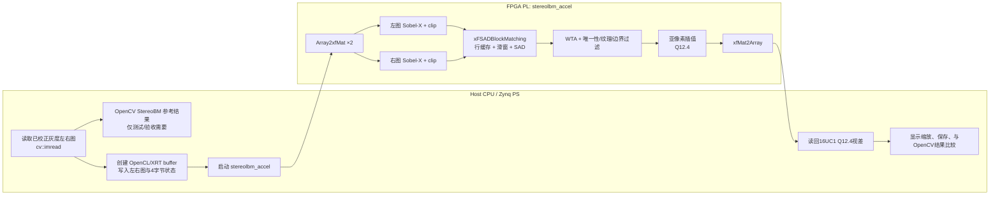
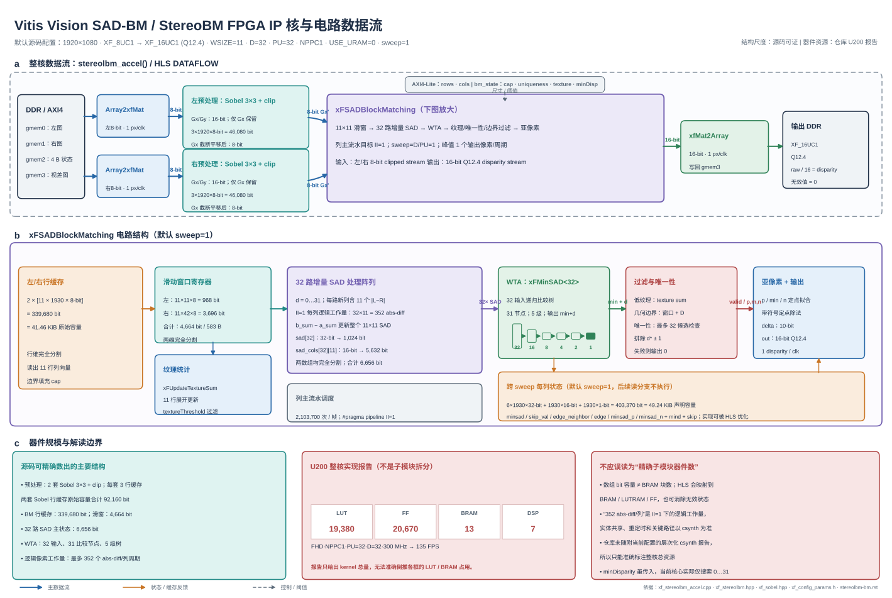
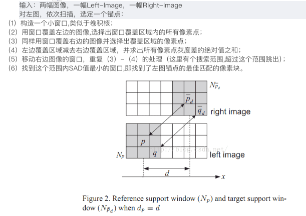

# Vitis Vision `SADBlockMatching` / `StereoBM` 双目立体匹配全流程分析

> 分析对象：本仓库 `Vitis_Libraries/vision` 子模块，代码基线为 `v2026.1_re`、HEAD `629b2c979f65561f07e4e87b860f306cb480895e`。
> 主流程以 `L2/examples/stereolbm` 的 Vitis host + HLS kernel 为准；`L1/examples/stereolbm` 主要用于 HLS/C 仿真，不代表完整的板卡运行时流程。
> 术语说明：仓库随附的 L2 公开性能表在 Alveo U200 上验证，此时“PS 侧”实际是外部 x86 host CPU；若部署到 Zynq/MPSoC，则这些 host 职责通常落在 PS。本文用“Host/PS”统一表示软件侧，用“PL”表示 HLS 综合出的 FPGA kernel。

## 目录

- [0. 默认设备与 FPGA 硬件资源](#0-默认设备与-fpga-硬件资源)
  - [0.1 “默认运行设备”的准确含义](#01-默认运行设备的准确含义)
  - [0.2 U200 实测资源与性能](#02-u200-实测资源与性能)
  - [0.3 资源数据的适用边界](#03-资源数据的适用边界)
- [1. 结论摘要](#1-结论摘要)
  - [1.1 实际使用的 Sobel 算子](#11-实际使用的-sobel-算子)
- [2. 默认配置与输入/输出契约](#2-默认配置与输入输出契约)
- [3. PS/PL 边界与全流程](#3-pspl-边界与全流程)
  - [3.1 逐步函数映射](#31-逐步函数映射)
  - [3.2 `xFSADBlockMatching` 专项分解](#32-xfsadblockmatching-专项分解)
  - [3.3 FPGA IP 核与电路结构图](#33-fpga-ip-核与电路结构图)
- [4. PL 内部算法细节](#4-pl-内部算法细节)
  - [4.1 预处理：Sobel-X + clip](#41-预处理sobel-x--clip)
  - [4.2 行缓存、视差分组和窗口](#42-行缓存视差分组和窗口)
  - [4.3 增量 SAD](#43-增量-sad)
  - [4.4 WTA、过滤与亚像素插值](#44-wta过滤与亚像素插值)
- [5. 并行度分析](#5-并行度分析)
  - [5.1 任务级并行](#51-任务级并行)
  - [5.2 像素并行](#52-像素并行)
  - [5.3 视差并行](#53-视差并行)
  - [5.4 存储与 AXI 并行](#54-存储与-axi-并行)
- [6. 周期、吞吐和带宽模型](#6-周期吞吐和带宽模型)
- [7. 主要瓶颈与影响排序](#7-主要瓶颈与影响排序)
  - [7.1 PL 计算瓶颈](#71-pl-计算瓶颈)
  - [7.2 Host/PS 与系统瓶颈](#72-hostps-与系统瓶颈)
  - [7.3 算法精度瓶颈](#73-算法精度瓶颈)
- [8. 源码中需要特别警惕的实现限制](#8-源码中需要特别警惕的实现限制)
- [9. 面向性能优化的建议](#9-面向性能优化的建议)
- [10. 关键源码索引](#10-关键源码索引)
- [11. 验证结论](#11-验证结论)

## 0. 默认设备与 FPGA 硬件资源

### 0.1 “默认运行设备”的准确含义

该示例需要区分**构建脚本默认值**与**仓库公开的实体板卡验证基线**：

| 口径 | 设备/模式 | 源码依据 | 结论 |
|---|---|---|---|
| 无参数构建默认值 | `PLATFORM=vck190`、`TARGET=hw_emu` | `L2/examples/stereolbm/Makefile:52-61` | 默认面向 VCK190 平台执行硬件仿真，不会直接运行在实体 FPGA 板卡上 |
| 支持的平台 | `vck190`、`u200` | `Makefile:67-69`、`description.json` | 可显式选择 VCK190 或 Alveo U200；U280、U250 被列入禁用名单 |
| 实体硬件运行 | 用户通过 `TARGET=hw` 和 `PLATFORM` 指定 | `Makefile:22-25, 142-148` | XCLBIN 与目标平台绑定，不能把为一块板卡生成的 XCLBIN 直接用于另一块板卡 |
| 仓库公开验证基线 | Alveo U200，300 MHz | `docs/src/stereolbm-bm.rst:54-69` | 下节的资源量和 FPS 均来自 U200 实测/实现结果，不是 VCK190 资源报告 |

因此，对“默认运行在哪个设备上”的准确回答是：**当前代码无参数时默认面向 VCK190 做 `hw_emu`；仓库给出的 SAD-BM 实体 FPGA 基准则运行在 Alveo U200 上。** kernel 的编译与链接目标频率均设为 300 MHz（`Makefile:150-159`）。

两类平台的 Host/PS 形态也不同：U200 是 PCIe 加速卡，由外部 x86 Host 通过 XRT/OpenCL 调度；VCK190 是 Versal 开发平台，Host 程序按 AArch64/嵌入式方式构建。Host 最终选择枚举到的设备并装载与该设备名匹配的 XCLBIN，而 SAD-BM 主体均在可编程逻辑中执行。

按器件总资源口径，两块目标平台的 LUT 容量为：

| 平台 | LUT 总量 | 相对关系 |
|---|---:|---:|
| VCK190 | **899,840** | U200 的约 100.9% |
| AMD Alveo™ U200 | **892K（约 892,000）** | VCK190 的约 99.1% |

这里的 LUT 总量是器件容量，不是 SAD-BM kernel 的实际占用。按图示规格，VCK190 的 LUT 总量比 U200 约多 0.9%，两者容量基本相当；跨平台实现还会受器件架构、综合和布局布线影响，不能仅按总量比例推导 VCK190 的实际资源报告。

### 0.2 U200 实测资源与性能

当前默认算法模板为 `WSIZE=11`、`NDISP=32`、`PARALLEL_UNITS=32`、`NPPC=1`、`XF_USE_URAM=0`，最大图像尺寸为 FHD 1920×1080。与这一 FHD 配置对应的 U200 公开资源如下；4K 行仅作为分辨率扩展时的对照。

| 分辨率 | NPPC | 并行视差/总视差 | LUT | 占 U200 总 LUT（892K） | FF | BRAM | DSP | FPGA 性能 |
|---|---:|---:|---:|---:|---:|---:|---:|---:|
| **FHD 1920×1080（当前默认）** | 1 | 32 / 32 | **==19,380==** | **约 2.17%** | **20,670** | **13** | **7** | **135 FPS** |
| 4K 3840×2160（对照） | 1 | 32 / 32 | ==19,005== | 约 2.13% | 21,113 | 26 | 7 | 34 FPS |

资源数字来自 `docs/src/stereolbm-bm.rst:71-98`，是该 L2 StereoLBM 设计在 U200、300 MHz 下的报告值。`XF_USE_URAM=0` 表示当前配置没有要求把主要缓存显式映射到 UltraRAM；原资源表没有单列 URAM，不能仅据此推导一个跨平台通用的 URAM 占用数。

若只把同一 LUT 数量与 VCK190 的 899,840 个总 LUT 作算术对照，FHD 的 19,380 LUT 约为 2.15%，4K 的 19,005 LUT 约为 2.11%。这两个百分比仅用于容量尺度比较，并非 VCK190 综合/实现后的实际占用率。

从资源结构看，LUT/FF 主要用于 32 路并行 SAD、比较树、控制与流水寄存器，BRAM 主要用于左右图行缓存和跨列状态。4K 配置的 BRAM 从 13 增至 26，而 LUT、FF、DSP 基本不变，符合图像宽度扩大主要增加行缓存深度、而计算并行结构保持不变的实现特征。

### 0.3 资源数据的适用边界

- 仓库内没有随附当前 VCK190 默认平台的 `csynth`/实现资源报告，因此不能把上述 U200 数字直接标成 VCK190 占用；若目标是 VCK190，应以该平台重新生成的 HLS synthesis、link/implementation 报告为准。
- `api-reference.rst:16947-17002` 还有一组 Vivado HLS 2019.1、XCZU9EG/XCZU7EV 的历史函数级数据。例如相同 `HD_11_32_32` 参数曾报告 49 BRAM_18K、20 DSP48E、34,519 FF 和 31,978 LUT。由于工具版本、器件和统计层级都不同，这组历史数据不能与当前 U200 L2 基准混用。
- 资源会随 `WSIZE`、`NDISP`、`PARALLEL_UNITS`、最大 `WIDTH`、`USE_URAM` 及目标时钟变化。尤其增加 `PARALLEL_UNITS` 会扩展 SAD/WTA 并行硬件，增加 `WIDTH` 则主要扩大行缓存；表中数字只代表列出的参数组合。

## 1. 结论摘要

- 对外 API 名称是 `xf::cv::StereoBM`，真正执行滑窗 SAD 的内部函数是 `xFSADBlockMatching`。
- 完整硬件数据通路为：两个==灰度==输入 → 两路 3×3 Sobel-X 与截断 → 行缓存/滑动窗口 → 分组并行 SAD → WTA 最小代价 → 纹理、边界与唯一性过滤 → 亚像素插值 → 16 位 Q12.4 视差图。
- 当前默认配置是 1920×1080 最大尺寸、`WSIZE=11`、`NDISP=32`、`PARALLEL_UNITS=32`、`NPPC=1`、`USE_URAM=0`，目标时钟 300 MHz。
- 有两层主要并行：任务级 `DATAFLOW` 并行，以及 32 路视差候选并行；像素并行固定为 `XF_NPPC1`，因此即使 32 个视差一次算完，峰值仍只有 1 个输出像素/周期。
- 首要吞吐瓶颈是 `sweepFactor = NDISP / PARALLEL_UNITS`。默认值为 1；若只扩大视差范围而不增加 `PARALLEL_UNITS`，PL 核心延迟近似按 sweep 数线性增加。
- 当前 L2 host 使用阻塞式 H2D 写入、单次 `enqueueTask`、阻塞式 D2H 读回，没有双缓冲和帧间传输/计算重叠；端到端系统中，这会成为 PL 之外的重要瓶颈。
- 该示例**不包含双目标定、同步采集、去畸变或极线校正**，输入必须已经是同尺寸、同步且极线对齐的 8 位灰度图。仓库中的 `stereopipeline` 示例才把 `InitUndistortRectifyMapInverse`、`remap` 和 `StereoBM` 串为更上游的完整立体流水线。
- 源码级限制：host 虽传入 `minDisparity`，当前 `xFSADBlockMatching` 实际只搜索并输出 `0...NDISP-1`，没有使用 `state.minDisparity` 偏移；因此非零最小视差配置当前无效。

### 1.1 实际使用的 Sobel 算子

设输入灰度图为 $I(y,x)$。StereoBM 预处理在 `xFStereoPreProcess` 中固定调用 3×3 Sobel；虽然接口同时生成 $G_x$ 和 $G_y$，但后续只保留 $G_x$，$G_y$ 被读出后丢弃。源码中实际使用的 Sobel-X 核为：

$$
K_x=
\begin{bmatrix}
-1 & 0 & 1\\
-2 & 0 & 2\\
-1 & 0 & 1
\end{bmatrix}.
$$

因此内部非边界像素的水平梯度为：

$$
\begin{aligned}
G_x(y,x)
&=\sum_{v=-1}^{1}\sum_{u=-1}^{1}K_x(v,u)I(y+v,x+u)\\
&=\big[I(y-1,x+1)+2I(y,x+1)+I(y+1,x+1)\big]\\
&\quad-\big[I(y-1,x-1)+2I(y,x-1)+I(y+1,x-1)\big].
\end{aligned}
$$

这里的“X”表示对水平方向 $x$ 求差分，所以它对左右灰度变化敏感，主要增强竖直边缘。真正送入 SAD 的不是有符号梯度 $G_x$，而是以 $C=\mathtt{preFilterCap}$ 限幅并平移后的 8 位无符号值：

$$
P_C(y,x)=\operatorname{clip}\!\left(G_x(y,x),-C,C\right)+C
=
\begin{cases}
0, & G_x<-C,\\
G_x+C, & -C\le G_x\le C,\\
2C, & G_x>C.
\end{cases}
$$

默认 $C=31$，所以 $P_C\in[0,62]$；图像最外一圈像素会先被强制令 $G_x=0$，因此映射后的边界值为 31。左右图分别执行同一变换，后续 SAD 实际比较的是 $P_C^L$ 与 $P_C^R$。对应源码为 `L1/include/imgproc/xf_sobel.hpp:32-80`（3×3 Sobel-X 核及计算）和 `L1/include/imgproc/xf_stereolbm.hpp:598-711`（边界处理、限幅平移及 StereoBM 预处理调用）。

## 2. 默认配置与输入/输出契约

默认宏位于 `L2/examples/stereolbm/config/xf_config_params.h:26-53`。

| 项目 | 当前默认值 | 实际含义 |
|---|---:|---|
| `HEIGHT × WIDTH` | `1080 × 1920` | HLS 编译期最大尺寸；本次 `rows/cols` 在运行时传入，但不得超过最大值 |
| `IN_TYPE` | `XF_8UC1` | 左右图均为 8 位无符号单通道 |
| `OUT_TYPE` | `XF_16UC1` | 16 位无符号视差，Q12.4；实际视差值为 `raw / 16.0` |
| `SAD_WINDOW_SIZE` / `WSIZE` | `11` | 11×11 SAD 支持窗口，必须为不小于 5 的奇数 |
| `NO_OF_DISPARITIES` / `NDISP` | `32` | 搜索 32 个整数视差候选，当前实现对应 0～31 |
| `PARALLEL_UNITS` / `NDISP_UNIT` | `32` | 每个列流水周期并行维护 32 个视差候选 |
| `NPPCX` | `XF_NPPC1` | 像素维度仅支持 1 pixel/clock |
| `XF_USE_URAM` | `0` | 默认不把主要缓存显式绑定到 URAM |
| `INPUT_PTR_WIDTH` | `8` | kernel 指针的逻辑输入元素宽度；物理 AXI 端口是否自动展宽应以综合报告为准 |
| `OUTPUT_PTR_WIDTH` | `16` | kernel 指针的逻辑输出元素宽度 |
| kernel 目标频率 | `300 MHz` | Makefile 对 `stereolbm_accel` 的 HLS/link 频率约束 |

L2 host 运行时传入的四个状态值位于 `xf_stereolbm_tb.cpp:25-28, 102-107`：

| 状态参数 | 示例值 | 是否在 PL 主算法中生效 |
|---|---:|---|
| `preFilterCap` | 31 | 生效；Sobel-X 截断范围为 `[-31, 31]`，随后平移到 `[0, 62]` |
| `uniquenessRatio` | 15 | 生效；相近的非相邻视差候选会令结果无效 |
| `textureThreshold` | 20 | 生效；左图窗口纹理和低于阈值则输出无效 |
| `minDisparity` | 0 | 0 时行为正确；非零值虽被写入状态对象，但核心搜索/输出未应用它 |

`WSIZE`、`NDISP`、`NDISP_UNIT`、图像类型、`NPPC` 和 `USE_URAM` 都是模板参数，修改后必须重新综合 kernel；它们不是可在每帧任意改变的运行时参数。

## 3. PS/PL 边界与全流程



### 3.1 逐步函数映射

下表同时表达**调用包含关系**和**执行顺序**。带“父函数/父模块”的行表示一个调用范围，其子行才是内部实际操作；父子行不是两次独立计算，不能把其延迟重复相加。

| 层级编号 | 调用层级 | 主要步骤 | 对应函数/语句 | 执行域 | 并行度与说明 |
|---:|---|---|---|---|---|
| 1 | Host 父函数 | 软件主流程 | `main()` | Host/PS | 包含 1.1～1.7；负责测试数据、设备调度、结果读回和验证 |
| 1.1 | ├─ Host 子步骤 | 读取左右图 | `cv::imread(argv[1/2], 0)` | Host/PS | 串行软件 I/O；只检查图像非空，没有检查左右尺寸相同 |
| 1.2 | ├─ Host 子步骤 | 生成参考结果 | `cv::StereoBM::create`、`compute` | Host/PS | 仅用于测试基准，不属于生产 PL 主链路；示例关闭了 OpenCV optimized path |
| 1.3 | ├─ Host 子步骤 | 设备与 xclbin 初始化 | `xcl::get_xil_devices`、`find_binary_file`、`cl::Program`、`cl::Kernel` | Host/PS | 多帧应用一般只初始化一次 |
| 1.4 | ├─ Host 子步骤 | 建立 buffer 与参数 | `cl::Buffer`、`kernel.setArg` | Host/PS | 左图、右图、状态、输出各一块全局内存 buffer |
| 1.5 | ├─ Host 子步骤 | 上传左右图和状态 | `enqueueWriteBuffer(..., CL_TRUE, ...)` ×3 | Host/PS → 设备全局内存 | 三次均为阻塞调用，没有与 kernel 或相邻帧重叠 |
| 1.6 | ├─ Host 子步骤 | 启动硬件 kernel | `queue.enqueueTask(kernel)` | Host/PS 发起，PL 执行 | 单 work-item/task kernel，不是 NDRange kernel；进入第 2 层 PL 调用树 |
| 1.7 | └─ Host 子步骤 | 下载、显示与验证 | `enqueueReadBuffer`、`convertTo`、`absdiff`、`analyzeDiff` | 设备全局内存 → Host/PS | kernel event 计时不含 H2D/D2H、图片保存、OpenCV 参考计算和验证 |
| 2 | PL 顶层父函数 | 硬件顶层 kernel | `stereolbm_accel` | PL | 包含 2.1～2.5；声明 AXI 接口并用顶层 `DATAFLOW` 连接数据搬运、StereoBM 和输出 |
| 2.1 | ├─ 顶层初始化 | AXI 接口与尺寸控制 | `m_axi gmem0...gmem3`、`s_axilite rows/cols/return` | PL | 左/右/状态/输出使用四个逻辑 M_AXI bundle；实际物理 bank 映射取决于链接结果 |
| 2.2 | ├─ 顶层初始化 | 构造并装载状态 | `xFSBMState`、四个 `bmState` 字段赋值 | PL | 读取 `preFilterCap`、`uniquenessRatio`、`textureThreshold`、`minDisparity` |
| 2.3 | ├─ DATAFLOW 子任务 | 左右全局内存转 `xf::cv::Mat` 流 | `xf::cv::Array2xfMat` ×2 | PL | 两路转换可以并发；默认每路 1 个 8 位像素/周期 |
| 2.4 | ├─ DATAFLOW 子函数 | StereoBM 算法入口 | `xf::cv::StereoBM` | PL | 父调用，内部继续进入 3 → 4 → 5 层；不是额外重复的一次算法 |
| 2.5 | └─ DATAFLOW 子任务 | 输出流写回全局内存 | `xf::cv::xfMat2Array` | PL | 默认 1 个 16 位结果/周期，与 2.3、2.4 通过流并发 |
| 3 | `StereoBM` 子调用 | 参数化包装层 | `xFFindStereoCorrespondenceLBM` | PL | 做非综合参数断言，并计算/传递 `SWEEP_FACT`；随后调用第 4 层 |
| 4 | `xFFind...LBM` 子调用 | 核心数据流组织层 | `xFFindStereoCorrespondenceLBMNO` | PL | 父函数；内部 `DATAFLOW` 包含 4.1、4.2 和第 5 层 SAD 核心 |
| 4.1 | ├─ DATAFLOW 父模块 ×2 | 左、右图预处理 | `xFStereoPreProcess` ×2 | PL | **包含 4.1.1～4.1.3**；左右两套预处理硬件并行工作，并非和下一行重复执行 Sobel |
| 4.1.1 | │  ├─ 预处理子函数 | 计算 X/Y 梯度 | `xf::cv::Sobel` | PL | 真正执行 3×3 Sobel；输入 NPPC1，输出 16 位有符号 X/Y 梯度 |
| 4.1.2 | │  ├─ 预处理子函数 | X 梯度截断、平移和 8 位化 | `xFImageClip`（内部调用 `xFImageClipUtility`） | PL | 只保留 X 梯度并映射至 `[0, 2×preFilterCap]`；列循环目标 II=1 |
| 4.1.3 | │  └─ 预处理子函数 | 排空未使用的 Y 梯度 | `xFReadOutStream` | PL | Y 梯度不参与 SAD；必须消费该流，避免 Sobel 输出反压导致 `DATAFLOW` 停滞 |
| 4.2 | └─ DATAFLOW 子任务 | 视差流写入 `imgOutput` | `_disp_mat.write(..., _disp_strm.read())` 循环 | PL | 目标 II=1；它是 `xFFind...LBMNO` 内部写回 Mat，不是顶层 DDR 写回 |
| 5 | `xFFind...LBMNO` 子调用 | SAD/WTA 核心父函数 | `xFSADBlockMatching` | PL | **包含 5.1～5.6**；消费左右预处理流，最后产生 Q12.4 视差流 |
| 5.1 | ├─ SAD 子步骤 | 构造行缓存和滑动窗口 | `left/right_line_buf`、`xFShiftRight`、`xFInsertLeft` | PL | 行维及窗口被分割/重构，以同时访问 `WSIZE` 行和多视差窗口列 |
| 5.2 | ├─ SAD 子步骤 | 分组视差扫描 | `loop_row`、`loop_mux`、`loop_col` | PL | 每轮处理 `NDISP_UNIT` 个视差；列循环目标 II=1，完整 sweep 数为 `NDISP/NDISP_UNIT` |
| 5.3 | ├─ SAD 子函数 | 纹理统计与增量 SAD | `xFUpdateTextureSum`、`xFSADComputeInc`、`sad_cols` | PL | 以“加入一列、减去一列”更新各候选窗口代价；默认一轮维护 32 个视差候选 |
| 5.4 | ├─ SAD 子步骤 | 边界过滤及组内/跨组 WTA | `skip_flag`、`xFMinSAD<NDISP_UNIT>::find`、`minsad/mind` | PL | 递归比较树求组内最小值；多 sweep 时用每列状态合并全局最小值 |
| 5.5 | ├─ SAD 子步骤 | 唯一性检查 | `loop_unique_search_0/1`、`skip/skip_val`、`edge/edge_neighbor` | PL | 检查非相邻竞争候选，并处理视差分组边界 |
| 5.6 | └─ SAD 子步骤 | 亚像素插值与有效性输出 | `minsad_p/n`、`delta`、`out_disp`、`out.write` | PL | 最后一轮 sweep 输出 16 位 Q12.4；低纹理、边界或唯一性失败位置写 0 |

对应的精简调用树如下：

```text
Host/PS: main
├─ cv::imread / OpenCV参考 / OpenCL-XRT调度
└─ enqueueTask("stereolbm_accel")
   PL: stereolbm_accel
   ├─ Array2xfMat(left)  ─┐
   ├─ Array2xfMat(right) ─┼─ 顶层 DATAFLOW
   ├─ xf::cv::StereoBM  ──┤
   │  └─ xFFindStereoCorrespondenceLBM
   │     └─ xFFindStereoCorrespondenceLBMNO
   │        ├─ xFStereoPreProcess(left)
   │        │  ├─ xf::cv::Sobel
   │        │  ├─ xFImageClip
   │        │  └─ xFReadOutStream
   │        ├─ xFStereoPreProcess(right)
   │        │  ├─ xf::cv::Sobel
   │        │  ├─ xFImageClip
   │        │  └─ xFReadOutStream
   │        ├─ xFSADBlockMatching
   │        │  ├─ xFUpdateTextureSum / 窗口移动
   │        │  ├─ xFSADComputeInc
   │        │  ├─ xFMinSAD / 唯一性检查
   │        │  └─ 亚像素插值 / out.write
   │        └─ disparity stream → imgOutput Mat
   └─ xfMat2Array ────────┘
```

### 3.2 `xFSADBlockMatching` 专项分解

`xFSADBlockMatching` 的接口是两路 8 位预处理像素流输入和一路 16 位视差流输出。进入该函数时，数据已经由 `xFStereoPreProcess` 产生并位于 PL 片上流中；离开该函数后，视差流先由 `xFFindStereoCorrespondenceLBMNO` 写入 `imgOutput`，再由顶层 `xfMat2Array` 写入 DDR。因此下表各步骤全部在 **PL**，不存在函数内部的 PS 计算或 PS↔DDR 搬运。

为便于量化，定义：

```text
H = 实际高度，W = 实际宽度，K = WSIZE
D = NDISP，U = NDISP_UNIT/PARALLEL_UNITS，S = D/U（合法配置要求整除）
He = H+K-1，We = W+K-1
P = He×We×S                  // 扩展列流水的总迭代数
Q = H×W×S                    // 完成窗口填充后的“像素×sweep”处理数
N = H×W                      // 最终输出像素数
```

默认配置 `H=1080, W=1920, K=11, D=U=32, S=1`，所以 `He=1090`、`We=1930`、`P=2,103,700`、`Q=N=2,073,600`。

| 顺序 | `xFSADBlockMatching` 内部步骤 | 主要代码/函数 | PS/PL | 作用 | 每帧计算量或状态操作量 | 数据搬运方向 |
|---:|---|---|---|---|---|---|
| 1 | 建立片上缓存与候选状态 | `left/right_line_buf`、`l/r_window`、`sad`、`sad_cols`、`minsad/mind/skip/...` | PL | 为 K×K 滑窗、多视差并行和跨 sweep WTA 保存历史数据；`USE_URAM` 决定部分大数组是否绑定 URAM | 这是综合期硬件资源，不是每帧动态分配；容量主要为 `O(KW + UK + W)`，窗口寄存器约 `K² + K(K+U-1)` 个 8 位元素 | 无 PS/DDR 搬运；在 PL BRAM/URAM/LUTRAM/寄存器中建立静态存储 |
| 2 | 扩展行、sweep、扩展列调度 | `loop_row → loop_mux → loop_col`，`pipeline II=1` | PL | 用边界填充后的坐标扫描整帧；每个 sweep 处理 U 个视差候选 | 列流水总迭代 `P=(H+K-1)(W+K-1)S`；默认 `2,103,700` 次。若实现达到 II=1，约同数量周期，即 300 MHz 下约 7.012 ms | 控制索引在 PL 内流动；不直接搬运像素 |
| 3 | 每行、每 sweep 初始化 SAD 状态 | `loop_sad_init` | PL | 清零 U 个 `sad[d]` 以及 U×K 个 `sad_cols[d][i]`，准备扫描当前扩展行 | 逻辑赋值 `He×S×U×(K+1)`；默认 `1090×32×12 = 418,560` 次。循环被 `UNROLL`，逻辑操作量不等于增加同等周期 | 常量 0 → PL 寄存器/分割后的 `sad`、`sad_cols` |
| 4 | 第 0 sweep 消费输入流并更新行缓存 | `if (sweep==0)`、`left.read()`、`right.read()`、`left/right_line_buf` | PL | 每个真实图像位置各消费一个左右预处理像素；边界位置写 `preFilterCap`；K 行缓存向历史方向更新 | 精确读取左右流各 `H×W` 个 8 位像素，共 `2N`；默认共 `4,147,200` 个 8 位流元素。行缓存下移的逻辑赋值约 `2(K-1)HeWe`，默认约 42.074 M 次 | `left_clipped/right_clipped hls::stream` → `tmp_l/tmp_r` → 左右 PL 行缓存；不访问 PS |
| 5 | 后续 sweep 按视差组复用行缓存 | `offset=sweep×U`、`right_line_buf[col-offset]` | PL | 当 `S>1` 时不重复读输入流，而从行缓存取同一左列和更向左的右列，形成下一组全局视差 | 所有 sweep 合计每个扩展列逻辑提取约 `2K` 个行缓存元素，即约 `2KP`；默认约 46.281 M 次 8 位片上读取/赋值。默认 `S=1`，没有“后续 sweep”分支 | PL 左右行缓存 → `l_tmp/r_tmp`；右图地址向左偏移 `sweep×U`，完全是片上复用 |
| 6 | 更新左图纹理和及左右滑动窗口 | `xFUpdateTextureSum`、`xFShiftRight`、`xFInsertLeft` | PL | 计算左窗口相对 `cap` 的纹理强度；移动 K×K 左窗口和 `K×(K+U-1)` 右窗口，并插入当前列 | 纹理统计为 `O(KP)`，每次迭代最多约 `2K` 次绝对差；默认上界约 46.281 M 次。窗口逻辑移动约 `K(2K+U-1)P` 个 8 位元素；默认约 1.226 B 次，但这些是完全分割窗口上的并行寄存器级更新，不是 DDR 传输 | `l_tmp/r_tmp` → `l_window/r_window`；旧窗口元素在 PL 寄存器/分割数组内移位；纹理结果 → `text_sum` |
| 7 | U 路增量 SAD | `loop_sad_compute`、`xFSADComputeInc` | PL | 对每个候选视差计算新进入的一列 K 个绝对差；减去离开窗口的旧列和，实现 K×K SAD 的滑动更新 | 主算术量为 `U×K×P` 次 8 位绝对差及同阶累加；默认约 **740.502 M 次绝对差/帧**。`sad_cols` 逻辑移位约 `U(K-1)P`，默认约 673.184 M 个 16 位状态移动 | `l_window/r_window` → 每路 `b_sum`；`sad_cols[d]` 旧列 → `a_sum`；更新结果 → `sad[d]` 和 `sad_cols[d]`，全部在 PL 内 |
| 8 | 纹理与几何边界过滤 | `text_sum[0]`、`skip_flag`、行列边界条件 | PL | 识别低纹理、上下窗口越界、左侧视差范围不足和右侧窗口越界像素 | 对每个完成窗口的位置、每个 sweep 执行，即 `Q` 组判断；默认 2,073,600 组，主要为常数数量的比较与逻辑或 | `text_sum`、`row/col` 控制状态 → 局部 `skip_flag`；无外部数据搬运 |
| 9 | 组内 WTA 与跨 sweep 合并 | `xFMinSAD<U>::find`、`minsad/mind` | PL | 在当前 U 个 SAD 中求最小值和局部索引；再与前面 sweep 的全局最小值合并 | 组内比较约 `(U-1)Q`；默认 `31×2,073,600 ≈ 64.282 M` 次候选比较。每个位置每个 sweep 最多维护 8 组跨 sweep 列状态；默认 S=1 只写状态、不需要恢复前一 sweep | `sad[0...U-1]` → 比较树 → `lminsad/lmind`；寄存器 ↔ `minsad/mind/skip/skip_val/edge/edge_neighbor/minsad_p/minsad_n` 片上列缓存 |
| 10 | 唯一性检查 | `loop_unique_search_0/1`、`gskip/gskip_val` | PL | 检查最佳视差 ±1 之外是否存在足够接近的竞争候选；存在则把当前像素标为无效 | 最多检查 `UQ` 个候选/帧，并附带阈值与索引比较；默认约 **66.355 M 次候选检查**。多 sweep 时总候选规模仍近似 `HWD` | 当前 `sad[]` 与跨 sweep 的 `skip_val/edge_neighbor` → `gskip/gskip_val`；均为 PL 内部状态 |
| 11 | 保存跨 sweep 最优值和相邻代价 | `minsad/mind/skip/... [col] = ...` | PL | 使下一 sweep 能恢复同一输出列的最佳 SAD、视差、唯一性状态及最佳视差左右邻居 | 每个 `Q` 位置写 `minsad`、`mind`、`skip`、`skip_val`、`edge_neighbor`、`edge`、`minsad_p`、`minsad_n` 共 8 组状态；当 `S>1` 时，后续 sweep 对应读取这些状态 | 局部寄存器 → 8 组 PL 每列缓存；下一 sweep 时 PL 每列缓存 → 局部寄存器 |
| 12 | 最后一 sweep 亚像素插值 | `p/n/k/num/delta`、定点除法 | PL | 用最佳视差左右邻居 SAD 拟合亚像素偏移，并形成 Q12.4 结果 | 仅最后 sweep 执行，共 N 个像素；每像素若 `k!=0` 最多 1 次定点除法，默认最多 2,073,600 次逻辑除法/帧，另有常数数量的加减、绝对值和移位 | `gmind/gminsad/gminsad_p/gminsad_n` → 亚像素组合逻辑/流水除法器 → `out_disp` |
| 13 | 合并无效标志并输出视差流 | `skip_flag \|= gskip`、`out.write(out_disp)` | PL | 将低纹理、边界和唯一性失败结果置 0；其余输出 Q12.4 视差 | 精确写出 N 个 16 位结果；默认 2,073,600 个元素，即 4,147,200 byte 片上流量。最后 sweep 的列循环仍以目标 II=1 输出 | `out_disp` → 16 位 `_disp_strm hls::stream` → `xFFind...LBMNO` 的 `_disp_mat.write`；之后才由顶层 `xfMat2Array` 写 DDR |

计算量解释：表中的数值是**每帧逻辑运算/状态更新次数**，用来判断面积、布线和算法热点；它们不是串行周期数。窗口、候选状态和比较树被数组分割、循环展开或纳入 `II=1` 流水后，大量操作在同一周期并发。例如默认配置约 740.5 M 次逻辑绝对差被组织在约 2.104 M 个列流水周期中，等价于每个列周期最多并行处理 `U×K=352` 个 SAD 像素差。实际是否达到 II=1、具体实例化多少算术单元，仍须以目标器件的 HLS schedule/`csynth.rpt` 为准。

### 3.3 FPGA IP 核与电路结构图



> 图中的“结构规模”是由数组维度、数据类型和 HLS pragma 直接推导的源码级逻辑容量；“器件规模”则引用仓库随附的 U200 整核实现报告。数组 bit 容量不等于 BRAM 块数，逻辑工作量也不等于最终实体算术单元数；各子模块的 LUT/FF/BRAM/DSP 分摊必须由目标器件的层次化 `csynth`/实现报告给出。

读图顺序为：

- **a：整核 HLS DATAFLOW**。展示四组 AXI 内存端口、两路 3×3 Sobel-X 预处理、SAD-BM 核心及 16 位 Q12.4 输出。
- **b：`xFSADBlockMatching` 放大电路**。重点标出双目行缓存、完全分割的滑窗寄存器、32 路增量 SAD、5 级 WTA 比较树、过滤及亚像素输出。
- **c：规模与证据边界**。默认 FHD 配置在 U200、300 MHz 下的整核报告为 **19,380 LUT、20,670 FF、13 BRAM、7 DSP、135 FPS**；仓库没有给出对应的子模块资源拆分。

原图为 SVG 矢量格式，可无损放大并选中文字；`figures/sad_bm_fpga_architecture.png` 和 `.pdf` 为同源导出版。

## 4. PL 内部算法细节

### 4.1 预处理：Sobel-X + clip

`xFStereoPreProcess` 对左右图各实例化一套：

1. `xf::cv::Sobel<XF_BORDER_CONSTANT, XF_FILTER_3X3, ...>` 同时产生 16 位有符号 X/Y 梯度。
2. `xFImageClip` 只保留 X 梯度。设 `Gx` 为水平梯度、`cap=preFilterCap`，输出为：

   ```text
   P = 0          , Gx < -cap
       Gx + cap   , -cap <= Gx <= cap
       2*cap      , Gx > cap
   ```

3. Sobel 的一像素外边界先被置为 `Gx=0`，因此 clip 后边界值为 `cap`。`xFSADBlockMatching` 扩展窗口的填充值同样是 `cap`。
4. Y 梯度虽然不参与匹配，但 `xFReadOutStream` 必须消费它，否则 Sobel 的第二输出流会反压并卡住整个 `DATAFLOW`。

`preFilterType` 形参没有参与分支选择；当前实现始终执行 Sobel，非综合断言也要求 `XF_STEREO_PREFILTER_SOBEL_TYPE`。

### 4.2 行缓存、视差分组和窗口

- 左右行缓存尺寸均为 `WSIZE × (COLS + WSIZE - 1)`，用于保留构造垂直窗口所需的历史行。
- 左窗口是 `WSIZE × WSIZE`；右窗口是 `WSIZE × (WSIZE + NDISP_UNIT - 1)`，从而在一轮中覆盖多个横向偏移。
- 第 0 个 sweep 从左右输入流各读一个新像素并更新行缓存。
- 后续 sweep 不再读外部像素流，而是复用行缓存；基础偏移为 `sweep × NDISP_UNIT`。组内索引 `d` 对应全局视差：

  ```text
  disparity = sweep * NDISP_UNIT + d
  ```

- 当前合法性断言要求 `NDISP` 能被 `NDISP_UNIT` 整除，所以正常配置下：

  ```text
  sweepFactor = NDISP / NDISP_UNIT
  ```

### 4.3 增量 SAD

传统块匹配代价为：

```text
SAD(x, y, d) = Σ |L'(x+i, y+j) - R'(x+i-d, y+j)|
               i,j∈WSIZE窗口
```

实现没有在每个 `(x,y,d)` 重新做 `WSIZE²` 次累加，而是：

1. 对每个候选视差计算新进入窗口的一整列绝对差和 `b_sum`，每列需要 `WSIZE` 个绝对差。
2. 从 `sad_cols[d]` 取出即将离开窗口的旧列和 `a_sum`。
3. 更新 `sad[d] += b_sum - a_sum`，并移动 `sad_cols[d]`。

因此周期复杂度对 `WSIZE` 不再是平方增长；窗口增大会主要增加并行加法/绝对差逻辑、窗口寄存器和行缓存资源，并加重时序，而非按 `WSIZE²` 直接增加像素循环次数。



### 4.4 WTA、过滤与亚像素插值

- `xFMinSAD<NDISP_UNIT>::find` 在当前分组内找最小 SAD；`minsad`、`mind` 在多个 sweep 之间保存每列的全局最小代价和视差索引。
- 若有相同最小值，比较代码使用 `<=`，在未被唯一性规则过滤时会偏向较大的候选索引。
- 唯一性阈值为：

  ```text
  threshold = minSAD * (1 + uniquenessRatio / 100)
  ```

  如果除最佳视差及其直接相邻视差外，仍存在不大于该阈值的候选，则像素被标记为无效。

- 还会过滤：
  - `text_sum < textureThreshold` 的低纹理位置；
  - 上下各约半个窗口宽度的边界；
  - 左侧不能容纳完整视差搜索范围的位置；
  - 右侧不能容纳半个窗口的位置。
- 设最佳整数视差代价为 `m`，左右邻居代价为 `p/n`，代码计算：

  ```text
  k     = p + n - 2*m + |p-n|
  delta = ((p-n) << 8) / k       (k != 0)
  raw   = (d*256 + delta + 15) >> 4
  ```

  `raw` 是 Q12.4，整数视差 `d` 在无亚像素偏移时对应 `raw = d × 16`。所有过滤失败位置输出 0。

## 5. 并行度分析

### 5.1 任务级并行

顶层 `stereolbm_accel` 使用 `#pragma HLS DATAFLOW`，使两路 `Array2xfMat`、`StereoBM` 和 `xfMat2Array` 通过流并发。`StereoBM` 内部再次使用 `DATAFLOW`，使左预处理、右预处理、SAD 核心和结果写回形成生产者—消费者流水。

因此左右 Sobel 不是先后复用一套硬件，而是两条可并行运行的处理通路。流深度默认配置为 2，系统依靠 ready/valid 反压保持正确性。

### 5.2 像素并行

- `NPC = XF_NPPC1`，且源码断言只允许 NPPC1。
- Sobel、clip、输入/输出转换和 SAD 列循环的目标均是 1 pixel/clock 或 `II=1`。
- 当 `sweepFactor=1` 且时序收敛时，稳定态上限是 1 个输出像素/周期；不能像其他 Vitis Vision 算子那样通过 NPPC8 直接达到 8 pixel/clock。

### 5.3 视差并行

- `NDISP_UNIT/PARALLEL_UNITS` 是每轮同时处理的候选视差数，默认 32。
- `sad[]`、`sad_cols[][]`、左右窗口等数组被完全分割或重构，列主循环要求 `II=1`；这定义了 32 路候选状态并行的体系结构。
- 组内最小值由递归比较树并行产生，唯一性搜索也位于同一列流水中。
- 源码没有随仓库附带当前配置的 HLS schedule/operator 报告，因此“具体复制了多少个减法器、绝对值单元和比较器”不能只由 C++ 逐字精确断言，应以目标器件的 `csynth.rpt` 为最终依据；能可靠确认的是接口级 32 视差/轮和列循环目标 II=1。

### 5.4 存储与 AXI 并行

- 四个逻辑 `m_axi` bundle 分别服务左图、右图、状态和输出，可由链接器映射到独立内存 bank/端口；仓库示例没有固定展示所有平台的物理 bank 映射，因此实际并发带宽仍取决于 `.xclbin` 链接结果和板级内存拓扑。
- `USE_URAM=0` 时行缓存和每列状态通常落在 BRAM/LUTRAM/寄存器组合；`USE_URAM=1` 会对行缓存、最小代价、视差索引、唯一性及邻居状态显式绑定 URAM。

## 6. 周期、吞吐和带宽模型

令：

```text
H = 实际图像高度
W = 实际图像宽度
K = WSIZE
S = NDISP / PARALLEL_UNITS
f = PL 时钟频率
```

从 `loop_row → loop_mux → loop_col` 的边界和 `II=1` 可得到 SAD 主体的一阶周期模型：

```text
C_SAD ≈ (H + K - 1) × (W + K - 1) × S
T_SAD ≈ C_SAD / f
```

此外还有 Sobel/转换的流水填充、函数边界和 AXI 事务开销。由于各大阶段在 `DATAFLOW` 中重叠，不能把每个阶段的 `H×W` 周期简单相加；稳定态由最慢阶段决定。

默认 FHD 配置：

```text
H=1080, W=1920, K=11, NDISP=32, PARALLEL_UNITS=32, S=1, f=300 MHz
C_SAD ≈ 1090 × 1930 = 2,103,700 cycles
T_SAD ≈ 7.012 ms
理论核心上限 ≈ 142.6 FPS
```

仓库 `docs/src/stereolbm-bm.rst` 给出的 U200 实测/验证结果为 FHD 135 FPS、4K 34 FPS；与包含边界和系统开销后的周期模型一致。文档还给出：

| U200、300 MHz、NPPC1、`NDISP=32`、`PARALLEL_UNITS=32` | LUT | 占 U200 总 LUT（892K） | BRAM | FF | DSP | FPGA FPS | CPU FPS |
|---|---:|---:|---:|---:|---:|---:|---:|
| FHD 1920×1080 | 19,380 | 约 2.17% | 13 | 20,670 | 7 | 135 | 35 |
| 4K 3840×2160 | 19,005 | 约 2.13% | 26 | 21,113 | 7 | 34 | 13 |

注意：该 L2 资源表只明确写出 NPPC、视差数和并行单元；当前示例配置中的窗口为 11，但表格自身未再次标注窗口大小。表中 CPU/FPGA FPS 是特定平台与构建结果，不应当直接外推到任意 Zynq 器件。

`api-reference.rst` 还保留了 Vivado HLS 2019.1、ZU9EG 的旧表。例如 `HD_11_32_32` 报告 300 MHz、6.912 ms、49 个 BRAM18k、20 个 DSP、34,519 FF、31,978 LUT。它与当前 U200 L2 表使用的器件、工具版本和统计边界不同，不能混为一组资源结论；6.912 ms 恰好是 `1080×1920/300 MHz`，相当于忽略扩展边界和流水填充的理想像素周期估算。

每帧最低外部存储有效载荷为：

```text
左图 1 byte/pixel + 右图 1 byte/pixel + 输出 2 byte/pixel
= 4 × H × W bytes/frame
```

FHD 为 8,294,400 byte/frame；若持续 135 FPS，仅有效载荷约 1.12 GB/s，尚未包括 AXI 包开销、内存效率和 host 侧拷贝。多 sweep 复用 PL 行缓存，不会按 sweep 数重复读取整帧 DDR，但计算周期会按 sweep 数增加。

## 7. 主要瓶颈与影响排序

### 7.1 PL 计算瓶颈

1. **视差 sweep 数——最直接的吞吐瓶颈**

   `NDISP/PARALLEL_UNITS > 1` 时，同一扩展行会被重复扫描。`NDISP=64, PU=32` 约为默认延迟的 2 倍；`NDISP=128, PU=32` 约为 4 倍。

2. **NPPC1 的结构性上限**

   即使 `NDISP=PARALLEL_UNITS`，仍最多 1 pixel/clock。默认 300 MHz 下，纯像素吞吐天花板约 300 Mpixel/s，无法靠增大视差并行度突破。

3. **大 `PARALLEL_UNITS` 带来的面积与时序压力**

   增大 PU 会复制/扩展 SAD 状态、绝对差累加、唯一性比较和 WTA 比较树；大窗口还会加宽列和累加路径。吞吐随 PU 改善，但 LUT/FF、布线拥塞和关键路径会明显增加，最终可能无法保持 300 MHz 或 II=1。

4. **行缓存和跨 sweep 列状态**

   `left/right_line_buf` 随 `WSIZE×WIDTH` 增长；`minsad/mind/skip/skip_val/edge/edge_neighbor/minsad_p/minsad_n` 随图像宽度增长。4K 相比 FHD 主要增加片上存储需求，当前 U200 文档中 BRAM 由 13 增至 26。

5. **亚像素除法与唯一性逻辑的时序/资源**

   最后一轮包含定点除法、邻居代价处理及多候选唯一性判断。它们不增加外层周期公式中的 sweep 数，但可能成为高频率下的组合/流水关键路径；最终必须查看 HLS 和实现后 timing report。

### 7.2 Host/PS 与系统瓶颈

1. **当前传输与计算完全串行**：三次阻塞写 → kernel → 阻塞读，没有 ping-pong buffer、异步 event 链或多帧流水。
2. **测试程序包含大量非生产工作**：OpenCV 参考计算、PNG/JPG 编码、逐像素负值转换、`absdiff` 和 `analyzeDiff` 都在 Host/PS；它们不属于 kernel event 计时，却会显著拉低程序端到端 FPS。
3. **物理内存端口映射不确定**：四个 AXI bundle 提供并行机会，但若最终落到共享 DDR 控制器或同一 bank，带宽和争用需在目标平台实测。
4. **输入若来自原始相机，校正可能更贵**：本示例不做去畸变/极线校正。若这些步骤放在 PS，内存往返和 CPU 开销可能超过 BM；若使用仓库 `stereopipeline` 放入 PL，则需要额外映射表存储、remap 带宽与资源。

### 7.3 算法精度瓶颈

- 局部 SAD 对低纹理、重复纹理、遮挡、反光和左右曝光差敏感；Sobel 预处理只能部分缓解亮度偏移。
- 当前实现只有纹理阈值、唯一性和边界过滤，没有左—右一致性检查、speckle 去除、遮挡填补或全局/半全局平滑。
- 无效值固定为 0，与“真实零视差”数值相同；系统若要区分两者，需要额外有效性掩码或约定。
- `WSIZE` 增大通常提高噪声稳定性，但会模糊深度不连续边缘并增加资源/启动边界；减小窗口则更易出现错误匹配。

## 8. 源码中需要特别警惕的实现限制

1. **`minDisparity` 未实际应用**

   `stereolbm_accel` 将 `bm_state_in[3]` 写入 `bmState.minDisparity`，但 `xFSADBlockMatching` 的候选索引、右图偏移和输出均只使用 `gmind`、`NDISP_UNIT`、`sweep`，无 `state.minDisparity`。无效值也直接定义为 0。因此当前可靠搜索范围只能按 0～`NDISP-1` 理解。

2. **`preFilterType` 不是运行时可选项**

   `xFStereoPreProcess` 接收该参数却未使用，硬件固定执行 3×3 Sobel；非综合断言要求 Sobel 类型。

3. **窗口和视差数是编译期参数**

   `xFSBMState` 中虽然存在 `SADWindowSize`、`numberOfDisparities` 等字段，但本实现真正决定电路的是模板参数 `WSIZE/NDISP/NDISP_UNIT`。L2 host 也只上传四个 8 位状态值。

4. **状态传输被限制为 `unsigned char`**

   L2 host 的状态 vector 只有 4 byte；这天然不能表达负的 `minDisparity`，也把可传阈值限制在 0～255。虽然类字段类型是 `int`，host 接口已经先收窄。

5. **硬件路径没有运行时防御性检查**

   类型、窗口、视差整除关系和阈值范围的 `assert` 位于 `#ifndef __SYNTHESIS__`，综合后不会在板上保护错误输入。集成方必须在 Host/PS 侧校验。

6. **L2 host 没有检查左右图尺寸相等或不超过编译期上限**

   它使用左图的 `rows/cols` 同时计算左右 buffer 大小并传给 kernel。左右图尺寸不一致会造成错误数据解释；超过 1920×1080 则违反当前 kernel 的编译期容量。

7. **示例 kernel 时间不是端到端时间**

   `CL_PROFILING_COMMAND_START/END` 只覆盖 `enqueueTask` 的 kernel 执行；H2D、D2H、OpenCV、图像编解码与验证均不在其中。

## 9. 面向性能优化的建议

| 优先级 | 建议 | 适用条件与代价 |
|---:|---|---|
| P0 | 先按业务最大视差选择 `NDISP`，避免无效扩大搜索范围 | 同时降低延迟、资源和左边界无效区；需保证覆盖真实几何视差 |
| P0 | 在资源允许时令 `PARALLEL_UNITS` 接近 `NDISP` | 可把 sweep 降到 1；会增加 LUT/FF、布线和时序压力，必须重新综合验证 II 与 Fmax |
| P0 | 用异步迁移、ping-pong buffer 和多帧 event 链重写 Host/PS 调度 | 提高持续帧率；需要额外 DDR buffer，且相机、DDR 和 PL 必须支持重叠 |
| P1 | 在目标板上明确把左右输入和输出映射到独立高带宽端口/bank | 减少 AXI 争用；平台相关，不能只凭 `gmem0...3` 名称假设已经物理分离 |
| P1 | 宽图或 BRAM 紧张时评估 `USE_URAM=1` | 能转移大量列状态和行缓存，但会消耗 URAM，并可能改变时序/布局 |
| P1 | 若输入为原始双目图，比较“PS 校正”与 PL `stereopipeline` 的端到端代价 | PL remap 可减少 CPU 和往返，但增加资源、映射表与外存带宽 |
| P2 | 增加左右一致性、speckle/遮挡后处理或有效性掩码 | 改善质量与可用性，但不是当前 `StereoBM` 核心已有功能，会增加一次反向匹配或额外处理 |
| P2 | 修复并验证 `minDisparity` 后再开放非零/负视差配置 | 需同时调整右图地址、输出值、边界和无效值语义，并与 OpenCV 做回归验证 |

## 10. 关键源码索引

| 证据 | 文件与行号 |
|---|---|
| L2 host：输入、OpenCV 参考、OpenCL 调度、计时和验证 | `L2/examples/stereolbm/xf_stereolbm_tb.cpp:30-247` |
| kernel AXI 接口、状态装载、顶层 DATAFLOW | `L2/examples/stereolbm/xf_stereolbm_accel.cpp:21-65` |
| 默认尺寸、窗口、视差、并行单元、NPPC 和位宽 | `L2/examples/stereolbm/config/xf_config_params.h:26-53` |
| 300 MHz 构建约束 | `L2/examples/stereolbm/Makefile:150-159` |
| `xFSBMState` 默认值与 sweep 计算 | `L1/include/common/xf_structs.hpp:65-105` |
| 增量列 SAD | `L1/include/imgproc/xf_stereolbm.hpp:225-250` |
| 行缓存、窗口、循环次序和 II=1 | `L1/include/imgproc/xf_stereolbm.hpp:270-450` |
| 纹理/边界过滤、WTA、唯一性和跨 sweep 状态 | `L1/include/imgproc/xf_stereolbm.hpp:452-575` |
| 亚像素插值、Q12.4 输出和无效值 | `L1/include/imgproc/xf_stereolbm.hpp:577-590` |
| Sobel、clip 和 Y 流排空 | `L1/include/imgproc/xf_stereolbm.hpp:598-714` |
| 内部 DATAFLOW 与 `xFSADBlockMatching` 调用 | `L1/include/imgproc/xf_stereolbm.hpp:799-833` |
| API 约束和调用链 | `L1/include/imgproc/xf_stereolbm.hpp:866-926` |
| 当前 U200 资源与 FPS | `docs/src/stereolbm-bm.rst:65-98` |
| API、Q12.4、历史资源/延迟表 | `docs/src/api-reference.rst:16882-17035` |

## 11. 验证结论

在当前默认配置下，可以把该实现概括为：

```text
Host/PS：准备两幅已极线校正的 8UC1 图像并管理 DDR/启动 kernel
PL：双路 Sobel-X → 11×11 增量 SAD → 32 视差全并行 WTA → 过滤/亚像素 → 16UC1 Q12.4
性能主项：约 1 pixel/clock，FHD@300 MHz 的 SAD 主体约 7.01 ms，仓库 U200 数据为 135 FPS
首要扩展风险：NDISP > PARALLEL_UNITS 后 sweep 线性增加；PU/WSIZE 增大则转化为资源与时序压力
```

上述结论以当前源码实际访问和 HLS pragma 为依据；器件上的最终 II、Fmax、AXI 位宽、资源和关键路径必须以该目标平台重新生成的 HLS synthesis、link/implementation 和 runtime profile 报告为准。
