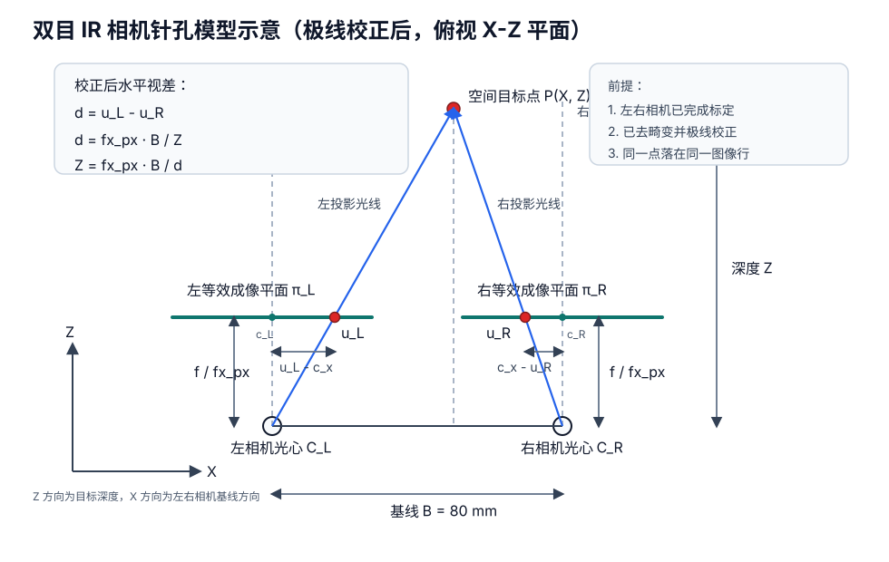
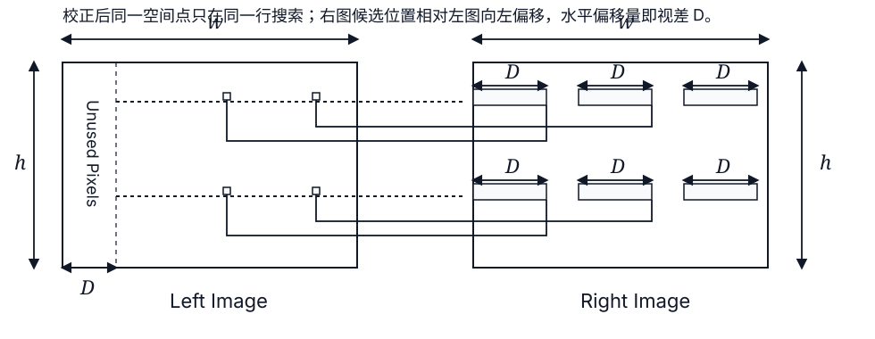
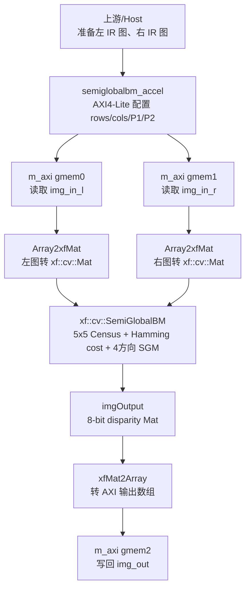
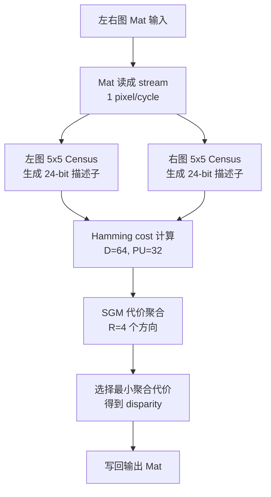
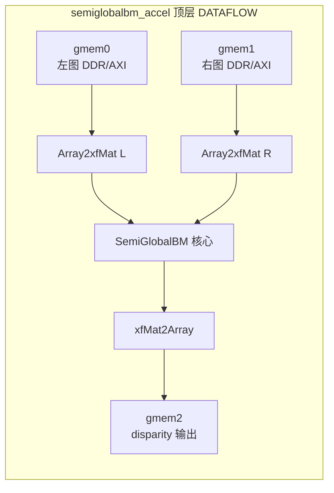
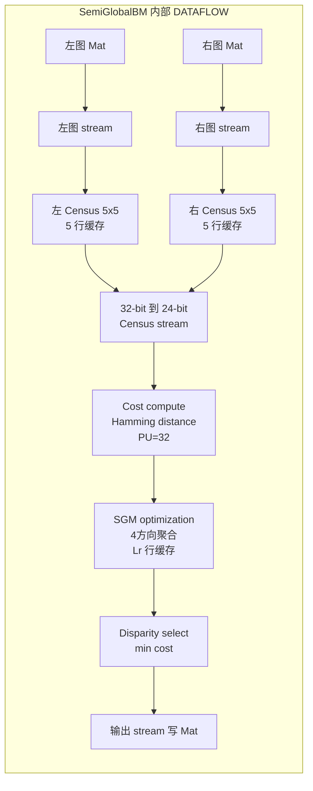

# 深度相机 FPGA 测算

## 目录

- [0. 双目 IR 相机建模与基线评估](#0-双目-ir-相机建模与基线评估)
  - [0.1 目标范围与基本公式](#01-目标范围与基本公式)
  - [0.2 8cm 基线下的视差范围](#02-8cm-基线下的视差范围)
  - [0.3 是否需要调整基线](#03-是否需要调整基线)
  - [0.4 当前相机建议参数表](#04-当前相机建议参数表)
  - [0.5 建模结论](#05-建模结论)
- [1. Matlab SGBM方案](#1-matlab-sgbm方案)
  - [1.1 结论先行](#11-结论先行)
  - [1.2 ALM 到 LUT 的换算口径](#12-alm-到-lut-的换算口径)
  - [1.3 1080p30 资源估算表](#13-1080p30-资源估算表)
  - [1.4 器件区间建议](#14-器件区间建议)
  - [1.5 国产纯 PL FPGA 资源与单价](#15-国产纯-pl-fpga-资源与单价)
  - [1.6 和当前本地工程的关系](#16-和当前本地工程的关系)
  - [1.7 参考依据](#17-参考依据)
- [2. Vitis Vision Library SGBM方案](#2-vitis-vision-library-sgbm方案)
  - [2.1 资料与本地代码](#21-资料与本地代码)
  - [2.2 示例参数](#22-示例参数)
  - [2.3 原版代码程序流程图](#23-原版代码程序流程图)
  - [2.4 当前流水线框图](#24-当前流水线框图)
  - [2.5 PL 内部 pipeline 计算/存储/数据量框图](#25-pl-内部-pipeline-计算存储数据量框图)
  - [2.6 1080p30 资源估算](#26-1080p30-资源估算)
  - [2.7 BRAM 与接口带宽拆解](#27-bram-与接口带宽拆解)
  - [2.8 更大视差扩展判断](#28-更大视差扩展判断)
  - [2.9 纯 PL FPGA 器件选型与外部 ARM 协同](#29-纯-pl-fpga-器件选型与外部-arm-协同)
  - [2.10 小结](#210-小结)

# 0. 双目 IR 相机建模与基线评估

## 0.1 目标范围与基本公式

目标探测距离为 `0.3 m ~ 1.5 m`，当前双目基线 `B = 8 cm = 0.08 m`，图像分辨率暂按 `1920 x 1080`，相机类型为近红外 `IR` 灰度相机。双目几何关系：

下图是极线校正后的平行双目针孔模型俯视示意，左右相机光轴平行，深度方向为 `Z`，水平方向为 `X`。实际 CMOS 成像平面在针孔模型中可等效画在光心前方 `f` 处，便于表达投影关系；图中的 `u_L`、`u_R` 是校正后左右图像中同一空间点的水平像素坐标。



对应的针孔投影关系：

```text
u_L = fx_px x X / Z + cx
u_R = fx_px x (X - B) / Z + cx
d = u_L - u_R = fx_px x B / Z
Z = fx_px x B / d
```

这个公式成立的前提是：左右相机完成内参标定、畸变校正和极线校正；左右图像行对齐，视差主要表现为水平方向像素差。若未校正，`d = u_L - u_R` 不能直接代入深度公式。

```text
Z = fx_px x B / d
d = fx_px x B / Z
```

其中：

| 符号 | 含义 | 当前口径 |
|---|---|---|
| `Z` | 目标深度/距离 | `0.3 m ~ 1.5 m` |
| `B` | 双目基线 | 当前 `0.08 m` |
| `d` | 左右图像视差 | 单位为 pixel |
| `fx_px` | 水平方向等效焦距 | 由镜头水平视场角 `HFOV` 和图像宽度决定 |

`fx_px` 与水平视场角的关系：

```text
fx_px = image_width / (2 x tan(HFOV / 2))
```

因为目前还没有固定镜头 FOV，这里按常见 `60° / 70° / 80° / 90°` 水平视场角做参数化估算。

## 0.2 8cm 基线下的视差范围

下图是极线校正后左右图中 disparity 的直观示意。左右图同一行上搜索匹配点，左右像点的水平偏移量就是视差 `D`；左图前 `D` 个像素没有对应的右图搜索位置，因此常被视为不可用边界。



在 `1920 x 1080`、`B = 80 mm` 下，不同镜头 FOV 对视差范围的影响如下：

| 水平 FOV | `fx_px` 估算 | `Z=0.3m` 近端视差 | `Z=1.5m` 远端视差 | `D=128` 可覆盖最近距离 | `D=256` 可覆盖最近距离 |
|---:|---:|---:|---:|---:|---:|
| `60°` | `1663 px` | `443 px` | `89 px` | `1.04 m` | `0.52 m` |
| `70°` | `1371 px` | `366 px` | `73 px` | `0.86 m` | `0.43 m` |
| `80°` | `1144 px` | `305 px` | `61 px` | `0.72 m` | `0.36 m` |
| `90°` | `960 px` | `256 px` | `51 px` | `0.60 m` | `0.30 m` |

这个表的关键含义是：`8cm` 基线对 `0.3m` 近距离会产生很大的视差。若镜头水平 FOV 是常见的 `70°` 左右，近端视差约 `366 px`，`D=128` 和 `D=256` 都覆盖不了 `0.3m`；只有在接近 `90°` 水平广角时，`D=256` 才刚好覆盖 `0.3m`，但几乎没有算法余量。

## 0.3 是否需要调整基线

若算法最大视差固定，为了覆盖 `Zmin = 0.3m`，基线需要满足：

```text
B <= Dmax x Zmin / fx_px
```

| 水平 FOV | 若 `Dmax=128`，建议基线上限 | 若 `Dmax=256`，建议基线上限 | 对当前 `80mm` 基线的判断 |
|---:|---:|---:|---|
| `60°` | `23 mm` | `46 mm` | 明显过大 |
| `70°` | `28 mm` | `56 mm` | 对 `D=256` 仍偏大 |
| `80°` | `34 mm` | `67 mm` | 对 `D=256` 略偏大 |
| `90°` | `40 mm` | `80 mm` | 对 `D=256` 勉强可用 |

基线不是越短越好。深度误差近似满足：

```text
delta_Z ~= Z^2 / (fx_px x B) x delta_d
```

也就是基线变短会降低远端深度精度。按 `1 px` 视差误差估算：

| 组合 | `0.3m` 处深度误差/px | `1.5m` 处深度误差/px | 若有 `0.25 px` 亚像素，`1.5m` 处误差 |
|---|---:|---:|---:|
| `HFOV=70°、B=80mm` | `~0.8 mm` | `~20.5 mm` | `~5.1 mm` |
| `HFOV=80°、B=60mm` | `~1.3 mm` | `~32.8 mm` | `~8.2 mm` |
| `HFOV=90°、B=60mm` | `~1.6 mm` | `~39.1 mm` | `~9.8 mm` |
| `HFOV=90°、B=80mm` | `~1.2 mm` | `~29.3 mm` | `~7.3 mm` |

因此：

| 目标实现 | 基线建议 | 原因 |
|---|---|---|
| 沿用 `D=64` | 不建议用于 `0.3m ~ 1.5m` | 即使 90° FOV，`0.3m` 也需要约 `256 px` 视差 |
| 使用 `D=128` | 建议 `25 ~ 40 mm` | 可覆盖 `0.3m`，但远距离深度精度会比 80mm 基线差 |
| 使用 `D=256` | 建议 `50 ~ 65 mm`，若 FOV 接近 90° 可到 `80 mm` | 覆盖 0.3m 的同时保留一定精度和实现余量 |
| 使用 `D=384/512` | 可以保留 `80 mm` | 近距离覆盖没问题，远距离深度精度更好，但 FPGA 资源和时序压力显著增加 |

从 FPGA 实现角度看，如果后续优先采用 Vitis Vision SGBM，`D=64` 是官方资源表的默认口径，`D=256` 是源码断言允许的上限；`8cm` 基线在 `0.3m` 近端更接近 `D=384` 这一档，已经超出默认配置很多。除非镜头是接近 `90°` 的广角并接受边界余量很小，否则建议把基线从 `80mm` 调到 `50 ~ 60mm`，或者明确把算法视差范围提升到 `384/512` 后再做资源评估。

## 0.4 当前相机建议参数表

| 参数 | 当前/建议值 | 说明 |
|---|---|---|
| 相机类型 | 近红外 IR 灰度相机 | SGBM 输入建议左右两路均为单通道灰度图 |
| 分辨率 | `1920 x 1080` | 当前测算统一按 1080p |
| 帧率 | `30 fps` | 算法吞吐目标为 `62.2 Mpixel/s` 输出视差图 |
| 输出位宽 | 建议传感器 `10/12 bit`，算法输入可压到 `8 bit` | Vitis 示例默认 `XF_8UC1`；若保留 10/12 bit，需要改算法数据类型和资源估算 |
| 快门方式 | 优先全局快门 | 双目匹配对运动同步敏感，rolling shutter 会增加误匹配 |
| 左右同步 | 硬件同步触发，曝光时间一致 | `0.3m ~ 1.5m` 近距离场景对同步误差更敏感 |
| 基线 `B` | 当前 `80 mm`；建议按算法 D 决定 | `D=256` 建议 `50 ~ 65 mm`；若坚持 `80 mm`，建议规划 `D>=384` 或使用接近 `90°` FOV |
| 镜头水平 FOV | 建议先定 `80° ~ 90°` | FOV 越大，`fx_px` 越小，近距离所需视差越小；但边缘畸变和标定难度会上升 |
| 等效焦距 `fx_px` | 约 `960 ~ 1144 px`，对应 `90° ~ 80° HFOV` | 用于把深度范围换算为视差范围 |
| 目标视差范围 | 约 `51 ~ 256 px`，若 `HFOV=90°、B=80mm` | 若 `HFOV=70°、B=80mm`，则约 `73 ~ 366 px` |
| 标定与校正 | 必须做双目标定、去畸变、极线校正 | SGBM 假设左右图已经极线对齐 |
| IR 光源 | 建议主动 IR 补光 + 窄带滤光片 | 增强低纹理表面的匹配稳定性，减少环境光干扰 |
| 曝光控制 | 左右相机锁定同一曝光/增益 | 自动曝光不同步会破坏左右图亮度一致性 |
| 机械结构 | 基线和相机姿态需刚性固定 | 基线误差会直接带来深度比例误差 |

## 0.5 建模结论

当前 `8cm` 基线对 `0.3m ~ 1.5m` 的距离段不是不能用，但它要求较大的最大视差。若镜头 FOV 约 `70°`，近端视差约 `366 px`，这会把算法推到 `D=384/512` 档；若使用 Vitis 默认 `D=64` 或常见 `D=128/256` 配置，近距离覆盖不足。

建议优先二选一：

| 方案 | 建议 |
|---|---|
| 控制 FPGA 资源和时序风险 | 把基线改到 `50 ~ 60 mm`，镜头选 `80° ~ 90° HFOV`，算法按 `D=256` 评估 |
| 保留 8cm 基线、追求远端精度 | 规划 `D=384/512` 视差范围，并重新评估 SGBM 资源、BRAM 和 Fmax |

# 1. Matlab SGBM方案

## 1.1 结论先行

MathWorks 这个例子给出的 `65 fps` 是 `1280 x 720、128 disparity levels` 下的核心算法吞吐，不是资源可以按 `30 / 65` 线性缩小。对于流水线 FPGA 设计，资源主要由并行度、视差层数 `D`、窗口/路径数量、行缓存宽度决定；fps 主要对应所需工作时钟。

1080p30 的像素吞吐量：

| 项目 | 计算 | 像素吞吐 |
|---|---:|---:|
| MathWorks 基准 | `1280 x 720 x 65` | `59.90 Mpixel/s` |
| 目标需求 | `1920 x 1080 x 30` | `62.21 Mpixel/s` |
| 目标 / 基准 | `62.21 / 59.90` | `1.038 x` |

因此，1080p30 和文档里的 720p65 基本是同一档吞吐需求，甚至目标还高约 `3.8%`。按文档给出的 `938,857 cycles/frame` 和 `61.69 MHz` 估算，若同样按像素数放大到 1080p：

```text
cycles_1080p ~= 938,857 x (1920 x 1080) / (1280 x 720)
             ~= 2,112,428 cycles/frame

Fclk_1080p30 ~= 2,112,428 x 30
             ~= 63.37 MHz
```

也就是说，如果沿用该单像素流式 SGBM 结构，1080p30 需要约 `63 MHz` 核心时钟。MathWorks 报告的 `61.69 MHz` 对 1080p30 略微偏紧，但非常接近；实际工程中要看综合布局布线、速度等级、约束和接口开销。

## 1.2 ALM 到 LUT 的换算口径

Intel 报告的是 `ALM`，Xilinx/AMD 等常见报告是 `LUT`，二者不能精确一一换算。Arria 10 的一个 ALM 内部包含可拆分的 LUT 资源和寄存器，可实现一个 6 输入函数，也可实现部分较小函数的组合。所以建议用两个口径：

| 口径 | 换算方式 | 用途 |
|---|---:|---|
| LUT6 功能等效下限 | `LUT6 ~= ALM x 1.0` | 粗看同级逻辑规模 |
| 跨厂商选型保守预算 | `LUT budget ~= ALM x 1.5 ~ 2.0` | 给采购/器件选型留布线、打包、HLS 差异余量 |

注意：不能用 `85,194 ALM x 30 / 65` 来估 LUT。降低 fps 通常是降时钟，不会自动减少 SGBM 的并行比较器、路径代价计算、min-tree 和行缓存。

## 1.3 1080p30 资源估算表

假设输入是左右两路已经校正好的 `1920 x 1080` 灰度图，输出 disparity/depth map；只估 MathWorks 链接中的 SGBM 核心，不含 MIPI/HDMI/DDR DMA、双目校正、滤波、深度单位换算、CPU/AXI 控制等外围逻辑。

| 场景 | 视差层数 D | 说明 | ALM 估算 | LUT6 等效下限 | 保守 LUT 预算 | Registers | Block Memory Bits | RAM Blocks | DSP Blocks | 时钟判断 |
|---|---:|---|---:|---:|---:|---:|---:|---:|---:|---|
| 文档基准 | 128 | `1280 x 720 @ 65fps`，MathWorks 原表 | `85,194` | `~85k` | `~128k ~ 170k` | `85,564` | `11.53 Mbit` | `741` | `129` | 文档给出 `61.69 MHz`，约 `65 fps` |
| 1080p30，沿用文档最大 D | 128 | 文档方案直接支持的最大视差层数；分辨率升到 1080p，D 不变 | `85k ~ 98k` | `85k ~ 98k` | `130k ~ 196k` | `86k ~ 100k` | `~17.3 Mbit` | `~1,110 ~ 1,250` | `129` | 需要约 `63.4 MHz`，接近基准 Fmax |
| 1080p30，按宽度等比例保持探测近距 | 192 | 由 `128 x 1920 / 1280 = 192` 得到；文档模型默认只支持到 `128`，需要扩展设计 | `125k ~ 140k` | `125k ~ 140k` | `190k ~ 280k` | `122k ~ 135k` | `~25.9 Mbit` | `~1,670 ~ 1,850` | `~193` | 吞吐仍约 `63.4 MHz`，但关键路径和 RAM 压力更大 |

## 1.4 器件区间建议

| 目标 | 建议 FPGA 资源区间 |
|---|---|
| 只按 MathWorks SGBM 核心、1080p30、D=128 | 逻辑按 `>= 130k ~ 200k LUT` 预算；片上 RAM 至少按 `~18 Mbit / ~1.2k RAM blocks` 档位看；DSP 至少 `130` 个；核心时钟需要 `~65 MHz` 余量 |
| 1080p30 且希望视差范围随 720p->1080p 等比例扩大，D≈192 | 逻辑按 `>= 190k ~ 280k LUT` 预算；片上 RAM 至少按 `~26 Mbit / ~1.8k RAM blocks` 档位看；DSP 至少 `200` 个；需要重新综合验证时序 |

## 1.5 国产纯 PL FPGA 资源与单价

价格口径：截至 `2026-07-09` 查询到的公开网页单价/阶梯价，实际采购会随库存、温度等级、速度等级、封装后缀、批量和税票变化。PH1A400、Titan-2 PG2T390H 这类高端料公开渠道多为询价，表中不把第三方库存页的“现货”或开发板价格直接等同于裸芯片可成交单价。

| 系列 | 代表型号 | 纯 PL/SoC 判断 | LUTs | DFFs | 分布式 RAM | eRAM/BRAM | DSP | PLL | 高速接口 | 用户 IO | 封装 | 公开芯片单价 | 对 1080p30 SGBM 的判断 |
|---|---|---|---:|---:|---:|---:|---:|---:|---|---:|---|---|---|
| SALEAGLE 4 | `EG4S20NG88` | 纯 PL，低成本 FPGA，内置 SDRAM | `19,600` | `19,600` | `156.8 Kbit` | `1.114 Mbit` eRAM + `64 Mbit` SDR SDRAM | `29` | `4` | 无高速 SerDes | `71` | QFN88 | 华秋：`1+ ¥51.867`，`100+ ¥46.104`，`500+ ¥44.07` | 逻辑、片上 RAM、DSP 都不足，只适合采集/接口/小型预处理 |
| SALEAGLE 4 | `EG4S20NG88I8` | 纯 PL，低成本 FPGA，内置 SDRAM | `19,600` | `19,600` | `156.8 Kbit` | `1.114 Mbit` eRAM + `64 Mbit` SDR SDRAM | `29` | `4` | 无高速 SerDes | `71` | QFN88 | 华秋：`1+ ¥66.68999`，`100+ ¥58.29199`，`500+ ¥55.32799` | 同上，不适合 1080p30 SGBM 主计算 |
| SALPHOENIX 1A | `PH1A60GEG324/C` | 纯 PL FPGA，无 ARM PS | `70,848` | `78,720` | `780 Kbit` | `3,160 Kbit` | `120` | `12` | 无 SerDes/DDR 硬核 | `211` | LFBGA324 | 云汉：`1190+ ¥129.95`，`3570+ ¥127.69`，`5950+ ¥124.30` | LUT/RAM 均不足；DSP 接近但仍不建议 |
| SALPHOENIX 1A | `PH1A90SBG484` | 纯 PL FPGA，无 ARM PS | `115,776` | `128,640` | `1,680 Kbit` | `5,440 Kbit` | `240` | `12` | `4 x 12.5Gbps SerDes`，DDR `x40` | `280` | LFBGA484 | 第三方页面可见约 `¥280`，需复核库存和税票 | 逻辑接近 D=128 下限，但片上 RAM 明显不足 |
| SALPHOENIX 1A | `PH1A90SEG324` | 纯 PL FPGA，无 ARM PS | `115,776` | `128,640` | `1,680 Kbit` | `5,440 Kbit` | `240` | `12` | `8 x 10.3125Gbps SerDes`，DDR `x16` | `148` | LFBGA324 | 淘宝 200rmb | 逻辑接近 D=128 下限，但片上 RAM 明显不足 |
| SALPHOENIX 1A | `PH1A90SEG325` | 纯 PL FPGA，无 ARM PS | `115,776` | `128,640` | `1,680 Kbit` | `5,440 Kbit` | `240` | `12` | `4 x 10.3125Gbps SerDes`，DDR `x40` | `180` | LFBGA325 | 公开商城多为询价，未取稳定单价 | 逻辑接近 D=128 下限，但片上 RAM 明显不足 |
| SALPHOENIX 1A | `PH1A180SFG676` | 纯 PL FPGA，无 ARM PS | `210,240` | `233,600` | `3,300 Kbit` | `12,920 Kbit` | `600` | `16` | `8 x 12.5Gbps SerDes`，DDR `x72` | `396` | FCBGA676 | 云汉：`200+ ¥446.20`，`600+ ¥438.44`，`1000+ ¥426.80` | 逻辑/DSP 够 D=128，片上 RAM 低于 `~18 Mbit` 估算，需要优化缓存或借外部 DDR |
| SALPHOENIX 1A | `PH1A400SFG676` | 纯 PL FPGA，无 ARM PS | `417,024` | `463,360` | `5,500 Kbit` | `18,280 Kbit` | `840` | `20` | `8 x 12.5Gbps SerDes`，DDR `x72` | `400` | FCBGA676 | 淘宝1400 | 最接近 D=128 1080p30：逻辑/DSP 足够，eRAM 刚到 `~18 Mbit` 级别 |
| SALPHOENIX 1A | `PH1A400SFG900` | 纯 PL FPGA，无 ARM PS | `417,024` | `463,360` | `5,500 Kbit` | `18,280 Kbit` | `840` | `20` | `16 x 12.5Gbps SerDes`，DDR `x72` | `500` | FCBGA900 | 公开库存页多为“询价”，未见稳定单价 | 同 `PH1A400SFG676`，IO/SerDes 更多，封装更大 |
| 紫光同创 Titan-2 | `PG2T390HFFBG900` | 纯 PL FPGA，无 ARM PS | `243,600 LUT6` | `487,200` | 标准参数图未列 | `17,280 Kbit DRM`，`480 x 36Kbit` | `840 APM` | `GPLL 10 + PPLL 10` | `16 x HSSTHP，12.5Gb/s max`；`1 x PCIe Gen3 x8`；DDR4 `1866Mbps`；ADC `1` 路专用 + `11` 路复用 | `500` | FFBG900，`-6` 工业级 | 裸芯片公开单价多为询价；ALINX AXP391 开发板公开价约 `¥5,699`，非裸片价 | 资源接近 PH1A400，DSP/DRM 足够 D=128；可评估 D=256，但若同时做校正仍需看片上 RAM/时序余量 |

注：Titan-2 的 `PG2T390HFFBG900` 行已按用户提供的标准参数图修正：`LUT6=243,600`、`FF=487,200`、`DRM=480 x 36Kbit`、`APM=840`、`GPLL/PPLL=10/10`、`HSSTHP=16 路 12.5Gb/s max`、`PCIe Gen3 x8=1`、速度等级 `-6`、工业级。图中未列“分布式 RAM”，因此表中不再填 `4,712 Kbit`。

按本文前面的估算，若坚持“纯 PL + 片上缓存为主”实现 `1080p30、D=128`，国产纯 PL 里面建议优先看 `PH1A400SFG676/SFG900` 或紫光同创 `Titan-2 PG2T390H`；`PH1A180SFG676` 的 LUT 和 DSP 余量够，但 eRAM 少于估算值，除非改 SGBM 缓存结构、降低视差/路径/代价位宽，或把部分缓存放到外部 DDR。`D≈192/D=256` 时，`PH1A400/PG2T390H` 的片上 RAM 也不算宽裕，需要重新架构或接受外部存储参与。

## 1.6 和当前本地工程的关系

当前打开的 `stereo-vision-fpga/hls/src/stereovision.h` 里写的是：

```cpp
#define MAX_WIDTH 1280
#define MAX_HEIGHT 720
typedef hls::StereoBMState<15, 128, 16> BM_STATE;
```

这说明本地 HLS 工程当前最大尺寸仍是 `720p`，并且算法是 `StereoBM` 风格，不是 MathWorks 链接里的五方向 SGBM HDL 方案。若要做 `1080p30`，需要至少把最大宽高、行缓存、接口带宽和 HLS 综合约束一起改掉，并重新看综合后的 LUT/BRAM/DSP/Fmax 报告。

## 1.7 参考依据

- MathWorks: Stereo Disparity Using Semi-Global Block Matching
  https://www.mathworks.com/help/visionhdl/ug/stereoscopic-disparity.html
- Intel: Arria 10 ALM Resources，说明 ALM 内含可拆分的 LUT-based resources、两个 ALUT 和四个寄存器
  https://docs.altera.com/r/docs/683461/current/arria-10-core-fabric-and-general-purpose-i/os-handbook/alm-resources
- ALM和LUT换算：
  - https://www.cnblogs.com/lobster89/p/8409780.html
  - https://www.myfpga.org/discuz/forum.php?mod=viewthread&tid=197709
- 安路 PH1A 官方选型表：
  https://www.anlogic.com/product/fpga/phoenix/ph1a
- 紫光同创 Titan-2 官方产品页：
  https://www.pangomicro.com/product/titan_family/194.html
- ALINX AXP391 开发板公开价格页，作为 Titan-2 PG2T390H 开发板价格参考，不能等同裸片价格：
  https://www.alinx.com/detail/728
- 安路 EG4/EAGLE 官方数据手册：
  https://anlogic.oss-cn-shanghai.aliyuncs.com/web_doc/%E5%B7%A5%E5%85%B7%E4%B8%8E%E8%B5%84%E6%96%99%E4%B8%8B%E8%BD%BD/%E6%8A%80%E6%9C%AF%E6%96%87%E6%A1%A3/EG4/%E6%95%B0%E6%8D%AE%E6%89%8B%E5%86%8C/DS300_Eagle_Datasheet_en.pdf
- 华秋商城 EG4S20 公开阶梯价：
  https://www.hqchip.com/gongsi/55964.html
- 云汉芯城 PH1A60GEG324 公开阶梯价：
  https://item.ickey.cn/ic/19113-643810753.html
- 云汉芯城 PH1A180SFG676 公开阶梯价：
  https://item.ickey.cn/ic/19113-643787411.html
- 用户提供的 ChatGPT 共享讨论，作为辅助参考线索；当前网页读取只返回登录页，正文内容未核验，因此本文资源/价格仍以官方资料和公开商城页为准：
  https://chatgpt.com/share/6a4f6858-a4fc-83ec-805e-4642f5863893

# 2. Vitis Vision Library SGBM方案

## 2.1 资料与本地代码

- GitHub 示例路径：
  https://github.com/Xilinx/Vitis_Libraries/tree/main/vision/L1/examples/sgbm
- 本地 L1 示例代码：
  `/Users/hanxiaobo/Desktop/codex/性能测算/Vitis_Libraries/vision/L1/examples/sgbm`
- 本地 Vitis `SemiGlobalBM` API 资源与性能表：
  `/Users/hanxiaobo/Desktop/codex/性能测算/Vitis_Libraries/vision/docs/src/api-reference.rst`
- 本地 L2 1080p SGBM 配置参考：
  `/Users/hanxiaobo/Desktop/codex/性能测算/Vitis_Libraries/vision/L2/examples/sgbm/config/xf_config_params.h`

## 2.2 示例参数

本节按 Vitis Vision L1 示例 `examples/sgbm` 估算。关键配置来自 `config/xf_config_params.h`、`xf_sgbm_accel.cpp` 和 `imgproc/xf_sgbm.hpp`。

| 参数 | Vitis L1 示例默认值 | 对双目 IR 灰度 1080p30 的含义 |
|---|---:|---|
| 输入/输出像素格式 | `XF_8UC1` / `XF_8UC1` | 已经是 8-bit 单通道灰度，适合 IR 灰度流；10/12-bit 传感器需前级压到 8-bit 或改库 |
| 默认最大尺寸 | `1280 x 720` | 需要改成 `1920 x 1080`；Vitis 仓库的 `vision/L2/examples/sgbm` 已经使用这个尺寸 |
| Census 窗口 | `WINDOW_SIZE = 5` | 固定 5x5 |
| 视差数 | `TOTAL_DISPARITY = 64` | 输出视差范围为 0~63；如果基线、焦距或近距要求更大，需要另行扩展 |
| 并行视差单元 | `PARALLEL_UNITS = 32` | 每轮并行算 32 个 disparity，`D=64` 需要 2 轮 |
| 聚合方向数 | `NUM_DIR = 4` | Vitis 文档说明这是对 Hirschmuller SGM 的 4 方向近似 |
| 像素并行度 | `NPPCX = XF_NPPC1` | 1 pixel/cycle 的接口，但内部 disparity 循环使单帧周期数大于像素数 |
| HLS 目标时钟 | `3.3 ns` | 约 `303 MHz`；若能收敛，满足 1080p30 有余量 |

## 2.3 原版代码程序流程图

下面是 Vitis Vision Library 原版 L1 `examples/sgbm` 的顶层程序流程。顶层函数是 `semiglobalbm_accel`，输入是左右两路灰度图指针，输出是 8-bit disparity map。



`SemiGlobalBM` 内部的算法流程可以简化理解为：



## 2.4 当前流水线框图

代码中有两层 `#pragma HLS DATAFLOW`：一层在 `semiglobalbm_accel` 顶层，把 AXI 搬运、SGBM 计算、结果写回串成 dataflow；另一层在 `SemiGlobalBM` 内部，把各算法 stage 用 `hls::stream` 串起来。





当前默认 `TOTAL_DISPARITY=64`、`PARALLEL_UNITS=32`，所以每个像素的 64 个候选视差会分成 `2` 轮并行处理。最主要的片上缓存来自 `SGM optimization` 里的 `Lr[R-1][NDISP][COLS]` 行缓存；最主要的吞吐压力来自 `D/PU` 的轮数和 4 方向聚合。

## 2.5 PL 内部 pipeline 计算/存储/数据量框图

下面按 `1920 x 1080`、`D=64`、`PU=32`、`R=4`、`NPPC1` 估算一帧数据量。当前 L1 代码默认 `1280 x 720`，如果不改 `HEIGHT/WIDTH`，表中的每帧数据量乘以 `1280 x 720 / 1920 x 1080 = 0.444`。

图中箭头表示数据方向；箭头上的数据量是“流过 pipeline 的数据量”，不代表全部落到片上 RAM。节点里的“存储”才是该 stage 实际依赖的主要存储单元。

```mermaid
flowchart LR
    A["外部 DDR/AXI<br/>gmem0 左图: 2.07 MB/frame<br/>gmem1 右图: 2.07 MB/frame"]
    B["Array2xfMat + Mat 读出<br/>计算: AXI word 转 xf::cv::Mat/stream<br/>存储: imgInputL/R FIFO 或 Mat buffer"]
    C["左右 Census 5x5<br/>计算: 5x5 比较生成 24-bit Census<br/>存储: 每路 5 x COLS 行缓存 + 5x5 窗口寄存器"]
    D["Census 32->24 stream<br/>计算: 截取有效 24-bit 描述子<br/>存储: hls::stream FIFO"]
    E["Cost compute<br/>计算: XOR + 24-bit Hamming popcount<br/>并行: PU=32, D=64 分2轮<br/>存储: r_buff[64] 右图描述子移位寄存器"]
    F["SGM optimization<br/>计算: 4方向路径代价递推 + P1/P2 惩罚 + min<br/>存储: Lr 行缓存 + Lr_min + 临时寄存器"]
    G["Disparity select<br/>计算: 对64个聚合代价取最小<br/>存储: min_cost/min_disp + tmp[PU] 寄存器"]
    H["xfMat2Array + 外部 DDR/AXI<br/>计算: disparity Mat 转 AXI word<br/>gmem2 输出: 2.07 MB/frame"]

    A -- "AXI读: 左2.07 + 右2.07 MB/frame" --> B
    B -- "8-bit 左/右像素流<br/>各2.07 MB/frame" --> C
    C -- "32-bit Census流<br/>左右各8.29 MB/frame" --> D
    D -- "24-bit Census流<br/>左右各6.22 MB/frame" --> E
    E -- "8-bit cost流<br/>2.07M px x 64 = 132.71 MB/frame" --> F
    F -- "16-bit aggregated cost流<br/>2.07M px x 64 x 2B = 265.42 MB/frame" --> G
    G -- "8-bit disparity流<br/>2.07 MB/frame" --> H
```



| Pipeline stage | 对应代码/函数 | 主要计算单元 | 主要存储单元 | 搬运/流过的数据量，1080p 每帧 | 实际需要保留的片上数据 |
|---|---|---|---|---:|---:|
| AXI 输入搬运 | `Array2xfMat` | AXI 到 `xf::cv::Mat` 的格式转换 | 外部 `gmem0/gmem1`，片上 Mat/FIFO | 左右输入合计 `4.15 MB` | FIFO 深度由 `XF_CV_DEPTH_IN_L/R=2` 控制 |
| Mat 到 stream | `SemiGlobalBM` 内部读 Mat 循环 | 1 pixel/cycle 读左右图 | `_src_l`、`_src_r` stream FIFO | 左右合计 `4.15 MB` | 主要是 stream FIFO，不存整帧 |
| Census 变换 | `xFCensusTransformKernel`、`xFCensus5x5` | 5x5 窗口比较，生成 24-bit Census 描述子 | 每路 `buf[5][COLS]` 行缓存，`src_buf[5][5]` 寄存器 | 左右各输出 `8.29 MB` 的 32-bit stream | 每路 `5 x 1920 x 8bit = 9.6 KB` 行缓存，左右约 `19.2 KB` |
| 32-bit 到 24-bit | `SemiGlobalBM` 内部转换循环 | 截取低 24-bit Census | `_src_census24_l/r` stream FIFO | 左右各 `6.22 MB` | stream FIFO，不存整帧 |
| Cost compute | `xFSGBMcomputecost` | 24-bit XOR + Hamming 距离，`PU=32` 并行 | `r_buff[NDISP]` 完全 partition 寄存器 | `132.71 MB` cost stream | `64 x 24bit = 192 B` 级别寄存器 |
| SGM optimization | `xFSGBMoptimization` | 4方向路径代价递推、`P1/P2` 惩罚、局部 min | `Lr[R-1][D][COLS]` BRAM 行缓存，`Lr_min`，临时寄存器 | `265.42 MB` aggregated cost stream | `Lr = 3 x 64 x 1920 B = 368.64 KB` 逻辑容量；物理约 `192 x BRAM_18K` |
| Disparity select | `xfSGBMcomputedisparity` | 每像素 64 个聚合代价取最小 | `tmp[PU]`、`min_cost`、`min_disp` 寄存器 | 输入 `265.42 MB`，输出 `2.07 MB` | 几十到数百字节寄存器 |
| AXI 输出搬运 | `xfMat2Array` | 输出 Mat 转 AXI word | `imgOutput` Mat/FIFO，外部 `gmem2` | `2.07 MB` disparity 输出 | FIFO 深度由 `XF_CV_DEPTH_OUT=2` 控制 |

这个 pipeline 的特点是：输入/输出带宽不大，但中间 `cost` 和 `aggregated cost` 是按 `像素数 x 视差数` 展开的高速内部 stream；真正占 BRAM 的不是整帧图像，而是 `SGM optimization` 为多方向、多视差保留的行缓存。

## 2.6 1080p30 资源估算

Vitis 本地文档 `vision/docs/src/api-reference.rst` 已给出同一算法在 `1920 x 1080、D=64、PU=32、5x5、1 pixel/clock` 下的资源表：

| 口径 | BRAM_18K | DSP48E | FF | LUT | 频率 | 单帧延迟 | 帧率判断 |
|---|---:|---:|---:|---:|---:|---:|---|
| Vitis 官方 FHD SGBM 核心 | `205` | `141` | `11,856` | `19,102` | `200 MHz` | `42 ms` | `~23.8 fps`，低于 30fps |
| 同一 RTL 周期数，跑到 30fps | `~205` | `~141` | `~12k` | `~19k` | `>=252 MHz` | `<=33.3 ms` | 刚满足 1080p30 |
| 按 L1 示例 `3.3 ns` 目标 | `~205` | `~141` | `~12k` | `~19k` | `~303 MHz` | `~27.7 ms` | `~36 fps`，前提是目标器件能过时序 |
| 工程选型保守预算 | `230 ~ 280` | `150 ~ 180` | `20k ~ 30k` | `30k ~ 45k` | `260 ~ 300 MHz` | `<=33.3 ms` | 给 AXI、控制、同步、小型预处理和布线留余量 |

30fps 的时钟推导：

```text
cycles_per_frame ~= 42 ms x 200 MHz
                 ~= 8.4 M cycles/frame

Fclk_1080p30 ~= 8.4 M cycles/frame x 30 fps
             ~= 252 MHz

latency_at_303MHz ~= 42 ms x 200 / 303
                  ~= 27.7 ms/frame
```

所以，按 Vitis 示例默认 `D=64、PU=32、R=4` 做双目 IR 灰度 `1080p30`，面积本身不大，主要风险是时序：`200 MHz` 不够，建议按 `260 ~ 300 MHz` 做约束和器件筛选。

## 2.7 BRAM 与接口带宽拆解

源码里 `xFSGBMoptimization` 定义了 `Lr[R - 1][NDISP][COLS]`，并对方向和视差两个维度完全 partition。1080p、`R=4、D=64、COLS=1920` 时：

```text
Lr memory count ~= (R - 1) x D
                = 3 x 64
                = 192 个独立行缓存

每个行缓存容量 ~= 1920 x 8 bit = 15,360 bit
```

每个 15,360 bit 行缓存基本占 1 个 `BRAM_18K`，因此 `Lr` 本身就约 `192 x BRAM_18K`；再加 `Lr_min`、左右图 5 行 census buffer、stream/FIFO 等，合计接近官方 `205 x BRAM_18K`。这说明它的 BRAM 数主要由 `方向数 x 视差数` 决定，在 `1920` 宽度下不是按有效 bit 利用率线性压缩。

接口带宽按 8-bit 左右 IR 灰度输入、8-bit disparity 输出估算：

| 项目 | 计算 | 带宽 |
|---|---:|---:|
| 左 IR 输入 | `1920 x 1080 x 8 x 30` | `~62.2 MB/s` |
| 右 IR 输入 | `1920 x 1080 x 8 x 30` | `~62.2 MB/s` |
| disparity 输出 | `1920 x 1080 x 8 x 30` | `~62.2 MB/s` |
| 合计 AXI/片外搬运净荷 | `3 x 1920 x 1080 x 30 byte` | `~186.6 MB/s` |

这个带宽对 DDR/AXI 不算高，但上表不包含 MIPI/CSI 接收、双目同步、去畸变/极线校正、坏点/降噪、IR 自动曝光、深度单位换算、置信度/后滤波等模块。若相机输出还未极线校正，rectification/remap 往往会额外吃 BRAM/URAM 或 DDR 带宽，不能算进上面的 `205 BRAM_18K`。

## 2.8 更大视差扩展判断

结合第 0 节的相机建模，`0.3m ~ 1.5m` 距离段很可能需要 `D=256` 甚至 `D=384/512`。不要直接套用 `D=64` 的官方数字：

| 扩展场景 | 估算资源 | 30fps 判断 |
|---|---|---|
| `D=128、PU=32` | `BRAM_18K ~400`，`DSP ~150 ~ 180`，`LUT ~30k ~ 45k`，`FF ~20k ~ 35k` | `D/PU` 从 2 轮变 4 轮，200MHz 延迟约 `84 ms`；30fps 需要约 `504 MHz`，不现实 |
| `D=128、PU=64` | `BRAM_18K ~400 ~ 430`，`DSP ~280 ~ 330`，`LUT ~45k ~ 70k`，`FF ~30k ~ 50k` | `D/PU` 回到 2 轮，理论延迟接近 `D=64、PU=32`，仍需 `>=252 MHz`；必须实际综合验证 |
| `D=256、PU=64` | `BRAM_18K ~800 ~ 860`，`DSP ~280 ~ 330`，`LUT ~55k ~ 90k`，`FF ~40k ~ 70k` | 可覆盖 `50 ~ 65mm` 基线的近端视差，但 `D/PU=4`，30fps 仍需要约 `504 MHz` |
| `D=256、PU=128` | `BRAM_18K ~800 ~ 900`，`DSP ~560 ~ 650`，`LUT ~90k ~ 150k`，`FF ~70k ~ 120k` | `D/PU` 回到 2 轮，才接近 30fps 所需吞吐；并行度很高，时序和布线风险大 |
| `D=384/512` | `BRAM_18K ~1,200 ~ 1,700`；若保持 30fps，DSP/LUT 也需按高 PU 上升 | 比较适合 `80mm + 70°~80° HFOV` 的 0.3m 近端；Vitis 源码断言默认 `NDISP<=256`，需要改库并重新综合 |

## 2.9 纯 PL FPGA 器件选型与外部 ARM 协同

本小节只讨论“纯 PL FPGA + 外部 ARM/SoC”的架构，不包含 Zynq/Versal 这类 FPGA 内置 ARM PS 的器件。选型判断按第 2 章的 Vitis SGBM 资源档位估算，实际仍要以 HLS 综合、布局布线、速度等级和接口 IP 为准。

先把算法档位压成三个选型门槛：

| SGBM 档位 | 适用相机几何 | 估算 FPGA 资源门槛 | 判断口径 |
|---|---|---|---|
| `D=64、PU=32` | 只适合远距或很小基线，不满足 `0.3m` 近端 | `30k ~ 45k LUT`，`230 ~ 280 BRAM_18K`，`150 ~ 180 DSP`，`260 ~ 300 MHz` | Vitis 官方 `D=64` 资源表加工程余量 |
| `D=128、PU=64` | 可覆盖较短基线的近距，仍偏紧 | `45k ~ 70k LUT`，`400 ~ 430 BRAM_18K`，`280 ~ 330 DSP` | 吞吐接近 `D=64、PU=32`，但资源上升 |
| `D=256、PU=128` | 建议用于 `50 ~ 60mm` 基线覆盖 `0.3m ~ 1.5m` | `90k ~ 150k LUT`，`800 ~ 900 BRAM_18K`，`560 ~ 650 DSP` | 比较符合当前距离需求，但时序/布线风险明显 |
| `D=384/512` | 保留 `80mm` 基线且镜头非超广角时需要 | `>=120k ~ 220k LUT`，`>=1,200 ~ 1,700 BRAM_18K`，高并行 DSP | 需要改 Vitis 源码上限并重新架构 |

### 2.9.1 国产纯 PL FPGA 档位

| 厂商/系列 | 代表型号 | 逻辑资源 | 片上 RAM | DSP | 外设/接口要点 | 部署可行性 | 裸芯片公开价格参考 |
|---|---|---:|---:|---:|---|---|---|
| 安路 SALEAGLE 4 | `EG4S20NG88` | `19,600 LUT` | `1.114 Mbit eRAM` + `64 Mbit SDR SDRAM` | `29` | 低成本、无高速 SerDes | 不适合 SGBM 主计算，只能做传感器控制、小型预处理或 glue logic | 华秋公开价约 `¥52/pcs`，批量约 `¥44 ~ 46/pcs` |
| 安路 PH1A | `PH1A60GEG324/C` | `70,848 LUT` | `3.160 Mbit eRAM`，约 `176 x BRAM_18K` | `120` | 无 SerDes/DDR 硬核 | `D=64` 的 BRAM/DSP 都偏紧，不建议做 1080p30 SGBM | 云汉阶梯价约 `¥125 ~ 130/pcs` |
| 安路 PH1A | `PH1A90SEG/SBG` | `115,776 LUT` | `5.440 Mbit eRAM`，约 `302 x BRAM_18K` | `240` | 部分型号有 SerDes、DDR `x16/x40`、MIPI IO | 可尝试 `D=64`；不建议 `D=128+`；需要验证 260MHz 级时序 | `PH1A90SEG324` 第三方约 `¥200`；`PH1A90SBG484` 约 `¥280`，需复核 |
| 安路 PH1A | `PH1A180SFG676` | `210,240 LUT` | `12.920 Mbit eRAM`，约 `718 x BRAM_18K` | `600` | SerDes、DDR `x72`、MIPI IO | `D=64` 稳妥，`D=128` 可评估；`D=256` 片上 RAM 不够，需要外部 DDR 或降规格 | 云汉阶梯价约 `¥427 ~ 446/pcs` |
| 安路 PH1A | `PH1A400SFG676/SFG900` | `417,024 LUT` | `18.280 Mbit eRAM`，约 `1,016 x BRAM_18K` | `840` | DDR `x72`，SerDes 更多 | 最适合安路路线；可评估 `D=256、PU=128`，但若还要 PL 内做双目校正，片上 RAM 仍偏紧 | `SFG676` 第三方约 `¥1,400/pcs`；`SFG900` 多为询价 |
| 紫光同创 Titan-2 | `PG2T70H` | `43,750 LUT` | `4.752 Mbit`，`132 x 36Kbit BRAM` | `240 APM` | DDR4 `1866Mbps`，HSST `4 x 12.5Gbps` | 可验证 `D=64`，不适合作为 0.3m 目标版 | 裸片公开价少，多为询价 |
| 紫光同创 Titan-2 | `PG2T160H` | `100,300 LUT` | `12.096 Mbit`，`336 x 36Kbit BRAM` | `480 APM` | DDR4 `1866Mbps`，HSST `8 x 12.5Gbps` | `D=128` 可评估；`D=256` 片上 RAM/DSP 偏紧 | 裸片公开价少，多为询价 |
| 紫光同创 Titan-2 | `PG2T390HFFBG900` | `243,600 LUT6`，`487,200 FF` | `17.280 Mbit DRM`，`480 x 36Kbit` | `840 APM` | DDR4 `1866Mbps`，`1 x PCIe Gen3 x8`，HSSTHP `16 x 12.5Gb/s max`，ADC `1` 路专用 + `11` 路复用，`GPLL 10 + PPLL 10`，`-6` 工业级 | 与 PH1A400 同档；可评估 `D=256、PU=128`，但双目校正进 PL 后仍需看余量 | 裸片公开价多为询价；ALINX AXP391 开发板约 `¥5,699`，非裸片价 |

国产纯 PL 路线建议：若目标坚持 `0.3m ~ 1.5m`，优先看安路 `PH1A400` 或紫光同创 `PG2T390H`；若把基线缩短且接受 `D=128`，安路 `PH1A180` 或 Titan-2 `PG2T160H` 可以作为中档候选。`PH1A90/PG2T70H` 更适合验证 `D=64` 版本或做接口/采集，不适合作为最终近距离深度核心。

### 2.9.2 AMD Xilinx 纯 PL FPGA 档位

AMD/Xilinx 官方 7-series 页面多用 `Logic Cells` 和 `Memory Kb/Mb`，UltraScale+ 页面给出 `CLB LUTs`。二者不要直接等同于本节里的 LUT 估算；下面用它们做选型档位判断。

| 厂商/系列 | 代表型号 | 官方逻辑资源 | 片上 RAM | DSP | 部署可行性 | 裸芯片公开价格参考 |
|---|---|---:|---:|---:|---|---|
| AMD Spartan-7 | `XC7S50` | `52,160 Logic Cells` | `2.700 Mbit`，约 `150 x BRAM_18K` | `120` | 不适合 SGBM 主计算，BRAM/DSP 都不足 | DigiKey 1pcs 约 `$79 ~ 95`，低功耗/封装版本约 `€68` |
| AMD Spartan-7 | `XC7S100` | `102,400 Logic Cells` | `4.320 Mbit`，约 `240 x BRAM_18K` | `160` | `D=64` 也非常紧，基本没有接口/校正余量；不建议 | DigiKey 1pcs 约 `$155 ~ 181` |
| AMD Artix-7 | `XC7A100T` | `101,440 Logic Cells` | `4.860 Mbit`，约 `270 x BRAM_18K` | `240` | 可尝试 `D=64`，但 260MHz 级时序和外围余量要谨慎 | DigiKey 1pcs/整包公开价约 `$126 ~ 245`，高速/大封装可到 `$360+` |
| AMD Artix-7 | `XC7A200T` | `215,360 Logic Cells` | `13.140 Mbit`，约 `730 x BRAM_18K` | `740` | `D=64` 较稳，`D=128` 可评估；`D=256` 不够 | DigiKey 1pcs 约 `$325 ~ 555` |
| AMD Kintex-7 | `XC7K325T` | `326,080 Logic Cells` | `16.020 Mbit`，约 `890 x BRAM_18K` | `840` | `D=128` 较合适；`D=256` 片上 RAM 卡边，时序需重点验证 | DigiKey 1pcs 约 `$1,883 ~ 3,865` |
| AMD Spartan UltraScale+ | `SU200P` | `100K CLB LUTs` | `26.79 Mbit`，约 `1,524 x BRAM_18K` | `384` | BRAM 够 `D=256`，DSP 不够 `PU=128`；适合低功耗中档、降低并行度或帧率 | 公开零售价少，多为询价 |
| AMD Kintex UltraScale+ | `XCKU3P` | `163K CLB LUTs` | `26.2 Mbit`，约 `1,491 x BRAM_18K` | `1,368` | 推荐档；`D=256、PU=128` 有资源余量，时序/接口风险低于 7-series | DigiKey 1pcs 约 `$1,559`；Octopart/分销约 `$1,900 ~ 2,630` |
| AMD Kintex UltraScale+ | `XCKU5P` | `217K CLB LUTs` | `34.9 Mbit`，约 `1,985 x BRAM_18K` | `1,824` | 更稳妥；可把双目校正、深度换算、后滤波部分也放 PL 内 | Mouser/DigiKey 常见公开价约 `£2,700 ~ 2,825` 或同档美元价，量产需询价 |
| AMD Virtex UltraScale+ | `XCVU3P` | `862K System Logic Cells` | `115.3 Mbit`，约 `6,559 x BRAM_18K` | `2,280` | 高端富余，适合多相机、多实例或高视差；单路 1080p30 成本/功耗偏高 | DigiKey CA 1pcs 约 `CAD $25,889`，约 `US$19k` 量级 |

Xilinx 路线建议：如果只做 Vitis `D=64`，Artix-7 高档或 Kintex-7 起步即可；如果要按当前 `0.3m ~ 1.5m` 目标做 `D=256`，建议从 `Kintex UltraScale+ XCKU3P/XCKU5P` 这一档开始看。`Spartan-7/Artix-7` 更适合成本敏感、视差范围较小的版本。

### 2.9.3 外部 ARM/SoC 需要做什么

纯 PL FPGA 没有内置 ARM PS，因此外部 ARM/SoC 至少要负责控制面；是否负责图像校正和深度后处理，取决于系统分工。

| 功能 | 建议放置位置 | 原因 |
|---|---|---|
| 传感器 I2C/SPI 配置、曝光/增益控制、同步触发 | 外部 MCU/ARM | 控制带宽低，软件迭代方便 |
| FPGA 配置、寄存器配置、参数加载 | 外部 MCU/ARM | 包括 `rows/cols/P1/P2`、标定参数、状态监控 |
| MIPI/并口采集 | FPGA PL 或外部 ARM/ISP | 若 FPGA 有 MIPI D-PHY/IP，可直接进 PL；否则用外部 SoC/桥接芯片更稳 |
| 去畸变/极线校正 rectification | 优先 PL；也可外部 ARM/GPU/ISP | SGBM 前必须完成。2 路 1080p30 remap 对 CPU 压力大，适合 PL line/tile buffer 或 SoC 的 GPU/RGA/VIC |
| SGBM 核心 | FPGA PL | 高并行、确定性延迟，是本文重点 |
| disparity 转 depth | PL 或外部 ARM | `Z = fB/d` 可用 LUT/定点除法，PL 做很便宜；若只输出给上位机，也可 ARM 后处理 |
| 无效视差、置信度、speckle/median 后滤波 | PL 或 ARM | 实时显示/控制建议 PL；算法迭代阶段 ARM 更方便 |
| 网络/USB/显示/存储/协议 | 外部 ARM/Linux SoC | 软件生态和驱动更合适 |

### 2.9.4 外部 ARM/SoC 型号建议

| 外部处理档位 | 代表型号 | 资源特征 | 适合承担的任务 | 不建议承担的任务 | 裸芯片/模块公开价格参考 |
|---|---|---|---|---|---|
| 控制 MCU | `STM32H743/STM32H747` | Cortex-M7 最高约 `480 MHz`，部分双核 M7+M4 | 传感器配置、FPGA 寄存器、同步触发、低速通信 | 2 路 1080p30 rectification、整帧深度图后处理 | `STM32H743VIT6` DigiKey 1pcs 约 `$15`，批量约 `$9.4 ~ 12` |
| 低功耗 Linux MPU | `NXP i.MX93` | 双 Cortex-A55 + Cortex-M33，带小型 NPU | 控制、网络、UI、参数管理、轻量后处理 | CPU 直接做双路 1080p30 remap 较吃紧 | 裸片多为询价；`FRDM-i.MX93` 开发板公开价约 `$83` |
| 中档视觉 SoC | `NXP i.MX 8M Plus` | Quad Cortex-A53 + Cortex-M7，NPU，双 camera input，ISP | MIPI/ISP、控制、显示、深度图转换、轻量后处理 | 纯 CPU 做复杂 rectification 不建议，最好用硬件图像单元或放 PL | `MIMX8ML8CVNKZAB` DigiKey 1pcs 约 `$59`，25+ 约 `$46` |
| 中高档国产 ARM | `Rockchip RK3588` | 4x Cortex-A76 + 4x Cortex-A55，多路 MIPI CSI，GPU/NPU/ISP | 原型开发、外部 rectification、显示/网络/AI 后处理 | 对成本/功耗很敏感的量产小板可能偏重 | LCSC 公开价约 `$67.68`；Alibaba 裸片约 `$40 ~ 55` |

推荐分工：

| FPGA 档位 | 外部 ARM 建议 | 推荐系统分工 |
|---|---|---|
| `D=64` 验证版 | `i.MX93` 或 `i.MX 8M Plus` | 外部做采集/校正/控制，FPGA 做 SGBM；适合验证算法链路 |
| `D=128` 中档版 | `i.MX 8M Plus` 或 `RK3588` | FPGA 做 SGBM，校正可在 PL 或 SoC 图像硬件上做 |
| `D=256` 目标版 | `RK3588` 原型；量产可换 `i.MX 8M Plus + PL校正` | 建议把 rectification 和 disparity-to-depth 尽量放 PL，ARM 做控制和应用层 |
| 低成本量产版 | `STM32H7 + PH1A400/PG2T390H/KU3P`，前提是 PL 内完成采集/校正/SGBM/depth | ARM 只做控制和通信，图像主链路不出 FPGA |

本小节资料依据：

- 安路 PH1A 官方产品表：
  https://www.anlogic.com/en/product/fpga/phoenix/ph1a
- 安路 PH1A 中文官方页，含 `60-400K LUTs`、MIPI-IO、DDR3/DDR4 等说明：
  https://www.anlogic.com/product/fpga/phoenix/ph1a
- 紫光同创 Titan-2 官方产品页：
  https://www.pangomicro.com/product/titan_family/194.html
- ALINX AXP391 开发板公开价格页，作为 Titan-2 PG2T390H 开发板价格参考，不能等同裸片价格：
  https://www.alinx.com/detail/728
- AMD 7 Series Product Tables and Product Selection Guide：
  https://docs.amd.com/v/u/en-US/7-series-product-selection-guide
- AMD UltraScale+ FPGAs Product Selection Guide：
  https://docs.amd.com/v/u/en-US/ultrascale-plus-fpga-product-selection-guide
- AMD Spartan-7 / Artix-7 / Kintex UltraScale+ / Spartan UltraScale+ / Virtex UltraScale+ 官方产品页：
  https://www.amd.com/en/products/adaptive-socs-and-fpgas/fpga/spartan-7.html
  https://www.amd.com/en/products/adaptive-socs-and-fpgas/fpga/artix-7.html
  https://www.amd.com/en/products/adaptive-socs-and-fpgas/fpga/kintex-ultrascale-plus.html
  https://www.amd.com/en/products/adaptive-socs-and-fpgas/fpga/spartan-ultrascale-plus.html
  https://www.amd.com/en/products/adaptive-socs-and-fpgas/fpga/virtex-ultrascale-plus.html
- ST STM32H7、NXP i.MX 8M Plus / i.MX93 官方页：
  https://www.st.com/en/microcontrollers-microprocessors/stm32h743-753.html
  https://www.nxp.com/products/i.MX8MPLUS
  https://www.nxp.com/products/processors-and-microcontrollers/arm-processors/i-mx-applications-processors/i-mx-9-processors/i-mx-93-applications-processor-family-arm-cortex-a55-ml-acceleration-power-efficient-mpu%3Ai.MX93

## 2.10 小结

若只接受 `64` 像素最大视差，Vitis SGBM 核心对 `1080p30` 的推荐预算可按 `~30k ~ 45k LUT、~20k ~ 30k FF、~230 ~ 280 BRAM_18K、~150 ~ 180 DSP、260 ~ 300 MHz` 看，但它不满足 `0.3m` 近距离需求。

若要覆盖 `0.3m ~ 1.5m`，建议优先按 `D=256` 重新评估，并把基线控制在 `50 ~ 60mm`；但为了维持 1080p30，`D=256` 还需要把 `PU` 提到 `128` 或采用等效并行结构。若坚持 `80mm` 基线，则需要按 `D=384/512` 重新架构和综合。
